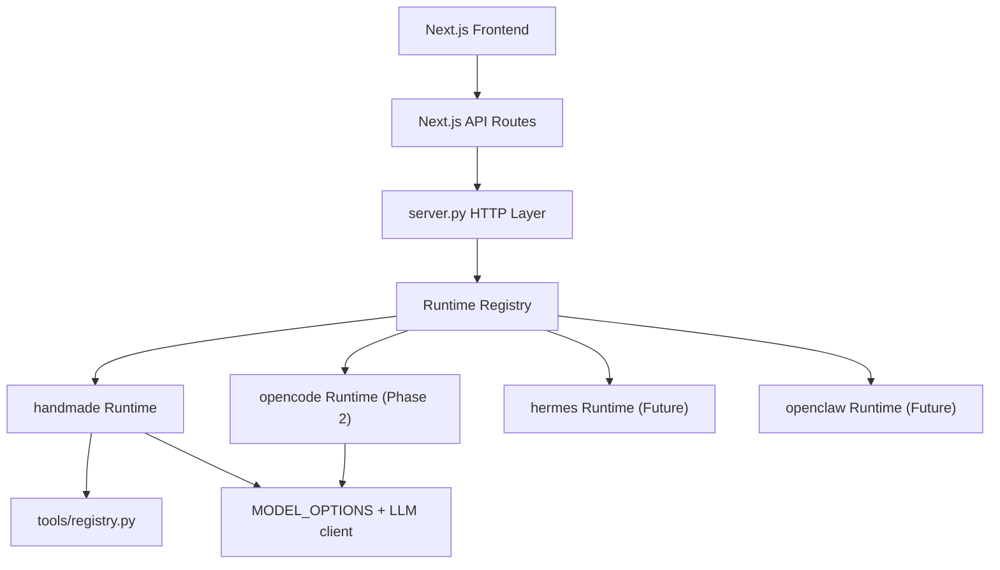

# Agent Runtime 切换技术设计

## 1. 背景

本文是 [Agent Runtime 切换专项 PRD](../product/agent-runtime-switching-prd.md) 的配套技术设计，描述如何在当前项目中落地“同一套前端页面切换不同底层 Agent Runtime”。

当前系统的聊天链路由 `server.py` 中的 `run_agent` 直接承载。它已经支持：

- 多模型配置。
- SSE 流式输出。
- 工具 registry。
- 工具审批。
- 技能注入。
- 会话摘要与上下文估算。

本技术方案的核心是将现有 `run_agent` 封装为第一个 Runtime：`handmade`，再通过统一 Runtime Adapter 协议预留 OpenCode、Hermes、OpenClaw 等外部 Runtime。

如果目标从“支持切换 Runtime”升级为“建设可兼容 OpenCode / Claude Code / OpenClaw 的统一 Agent 工作台”，请继续参考：[Agent Runtime Workbench 通用架构文档](./agent-runtime-workbench-architecture.md)。

## 2. 设计目标

- 保持现有 `/api/chat`、`/api/chat/stream` 兼容。
- 不传 `runtime` 时默认走 `handmade`，旧前端和旧会话不受影响。
- 新增 `/api/runtimes`，用于前端展示可用 Runtime。
- 前端会话保存 `runtimeId`，和 `modelId` 分离。
- 所有 Runtime 尽量输出统一 SSE 事件。
- 外部 Runtime 默认受工作区和权限边界限制。

## 3. 非目标

- Phase 1 不实现 OpenCode/Hermes/OpenClaw 的真实接入。
- Phase 1 不重构模型 provider 系统。
- Phase 1 不重写工具 registry。
- Phase 1 不引入数据库。
- Phase 1 不改变摘要接口和上下文估算接口的行为。

## 4. 总体架构



前端只关心：

```text
runtimeId
modelId
SSE events
ToolStep[]
```

后端负责把不同 Runtime 的输出翻译为统一事件协议。

## 5. 文件结构

建议新增：

```text
runtimes/
  __init__.py
  base.py
  registry.py
  handmade.py
  opencode.py
```

Phase 1 必需：

```text
runtimes/base.py
runtimes/registry.py
runtimes/handmade.py
```

Phase 2 再增加：

```text
runtimes/opencode.py
```

## 6. 后端核心类型

### 6.1 AgentRuntime

`runtimes/base.py`

```python
from dataclasses import dataclass
from typing import Any, Callable, Dict, List, Optional

EventSink = Callable[[str, dict], None]

@dataclass
class RuntimeRequest:
    messages: List[dict]
    model_id: Optional[str] = None
    session_id: Optional[str] = None
    trusted_tools: Optional[List[str]] = None

@dataclass
class RuntimeResult:
    answer: str
    steps: List[dict]
    trace_id: str
    model: Optional[str] = None
    runtime: Optional[str] = None

class AgentRuntime:
    id: str
    label: str
    description: str
    capabilities: Dict[str, Any]

    def available(self) -> bool:
        return True

    def unavailable_reason(self) -> str:
        return ""

    def public_info(self, default_id: str) -> dict:
        return {
            "id": self.id,
            "label": self.label,
            "description": self.description,
            "available": self.available(),
            "default": self.id == default_id,
            "unavailable_reason": self.unavailable_reason(),
            "capabilities": self.capabilities,
        }

    def run(self, request: RuntimeRequest, event_sink: EventSink | None = None) -> RuntimeResult:
        raise NotImplementedError
```

如果为了兼容 Python 3.9，`EventSink | None` 应写成 `Optional[EventSink]`。

### 6.2 Runtime capabilities

建议能力字段稳定为：

```python
{
    "chat": True,
    "stream": True,
    "tools": True,
    "tool_approval": True,
    "file_read": True,
    "file_write": True,
    "shell": True,
    "skills": True,
    "memory": "local_summary",
    "workspace_scope": "project",
    "experimental": False,
}
```

前端只使用其中少量字段做标签展示。其余字段给后续配置页和安全策略使用。

## 7. Runtime Registry

`runtimes/registry.py`

```python
import os

from runtimes.handmade import HandmadeRuntime

DEFAULT_RUNTIME_ID = os.getenv("DEFAULT_RUNTIME_ID", "handmade")

RUNTIME_OPTIONS = [
    HandmadeRuntime(),
]

RUNTIMES_BY_ID = {runtime.id: runtime for runtime in RUNTIME_OPTIONS}

def get_runtime(runtime_id=None):
    requested_id = runtime_id or DEFAULT_RUNTIME_ID
    runtime = RUNTIMES_BY_ID.get(requested_id)
    if not runtime:
        allowed = ", ".join(RUNTIMES_BY_ID)
        raise ValueError(f"未知 Agent Runtime：{requested_id}。可用 Runtime：{allowed}")
    return runtime

def public_runtime_options():
    default_runtime = get_runtime()
    return {
        "runtimes": [runtime.public_info(default_runtime.id) for runtime in RUNTIME_OPTIONS],
        "default": default_runtime.id,
    }
```

## 8. Handmade Runtime

Phase 1 不应重写 `run_agent`，只做薄封装。

`runtimes/handmade.py`

```python
from runtimes.base import AgentRuntime, RuntimeRequest, RuntimeResult

class HandmadeRuntime(AgentRuntime):
    id = "handmade"
    label = "Handmade Agent"
    description = "当前项目内置的轻量手写 Agent。"
    capabilities = {
        "chat": True,
        "stream": True,
        "tools": True,
        "tool_approval": True,
        "file_read": True,
        "file_write": True,
        "shell": True,
        "skills": True,
        "memory": "local_summary",
        "workspace_scope": "project",
        "experimental": False,
    }

    def run(self, request, event_sink=None):
        # 避免循环 import：可以在方法内部 import server.run_agent
        from server import get_model_config, run_agent

        result = run_agent(
            request.messages,
            request.model_id,
            event_sink=event_sink,
            trusted_tools=request.trusted_tools or [],
        )
        model = get_model_config(request.model_id)["id"]
        return RuntimeResult(
            answer=result["answer"],
            steps=result["steps"],
            trace_id=result["trace_id"],
            model=model,
            runtime=self.id,
        )
```

注意：如果 `server.py` import `runtimes.registry`，而 `handmade.py` 再 import `server`，需要把 import 放到方法内部，避免模块加载时循环 import。

## 9. server.py 改造

### 9.1 新增 GET /api/runtimes

在 `Handler.do_GET` 中增加：

```python
if path == "/api/runtimes":
    self.send_json(200, public_runtime_options())
    return
```

导入：

```python
from runtimes.registry import get_runtime, public_runtime_options
from runtimes.base import RuntimeRequest
```

### 9.2 POST /api/chat

当前逻辑：

```python
result = run_agent(messages, model_id, trusted_tools=trusted_tools)
result["model"] = get_model_config(model_id)["id"]
self.send_json(200, result)
```

改为：

```python
runtime_id = body.get("runtime")
runtime = get_runtime(runtime_id)
request = RuntimeRequest(
    messages=messages,
    model_id=model_id,
    session_id=body.get("session_id"),
    trusted_tools=trusted_tools,
)
result = runtime.run(request)
self.send_json(200, {
    "answer": result.answer,
    "steps": result.steps,
    "trace_id": result.trace_id,
    "model": result.model,
    "runtime": result.runtime,
})
```

### 9.3 POST /api/chat/stream

当前逻辑：

```python
result = run_agent(messages, model_config["id"], event_sink=event_sink, trusted_tools=trusted_tools)
result["model"] = model_config["id"]
```

改为：

```python
runtime_id = body.get("runtime")
runtime = get_runtime(runtime_id)
request = RuntimeRequest(
    messages=messages,
    model_id=model_config["id"],
    session_id=body.get("session_id"),
    trusted_tools=trusted_tools,
)
result = runtime.run(request, event_sink=event_sink)
```

### 9.4 message_start 事件补 runtime

当前 `run_agent` 的 `message_start` payload：

```python
{"id": "...", "model": actual_model_id, "trace_id": trace_id}
```

Phase 1 可以先由 `handmade` 保持不变，前端使用请求 runtime 作为兜底。

更完整的做法是在 `run_agent` 增加可选参数：

```python
def run_agent(..., runtime_id="handmade"):
```

并输出：

```python
{"id": "...", "model": actual_model_id, "runtime": runtime_id, "trace_id": trace_id}
```

推荐 Phase 1 做这个小改动，便于每条消息保存实际 runtime。

## 10. Next.js API Route 改造

新增：

```text
frontend/src/app/api/runtimes/route.ts
```

内容：

```ts
import { proxyBackend } from "../_backend";

export async function GET() {
  return proxyBackend("/api/runtimes");
}
```

现有 `/api/chat` 和 `/api/chat/stream` 不需要改动，因为它们透传 request body。

## 11. 前端类型改造

`frontend/src/lib/types.ts`

新增：

```ts
export type RuntimeCapabilities = {
  chat?: boolean;
  stream?: boolean;
  tools?: boolean;
  tool_approval?: boolean;
  file_read?: boolean;
  file_write?: boolean;
  shell?: boolean;
  skills?: boolean;
  memory?: string;
  workspace_scope?: string;
  experimental?: boolean;
};

export type RuntimeOption = {
  id: string;
  label: string;
  description: string;
  available: boolean;
  default: boolean;
  unavailable_reason?: string;
  capabilities: RuntimeCapabilities;
};
```

扩展：

```ts
export type AgentResponse = {
  answer: string;
  steps: ToolStep[];
  model?: string;
  runtime?: string;
  trace_id?: string;
};
```

## 12. AgentChat 改造

### 12.1 数据结构

`DisplayMessage` 增加：

```ts
runtime?: string;
```

`ChatSession` 增加：

```ts
runtimeId: string;
```

新增 storage key：

```ts
const RUNTIME_STORAGE_KEY = "agent:runtime";
```

### 12.2 session 兼容迁移

`makeSession`：

```ts
function makeSession(modelId = "", runtimeId = ""): ChatSession
```

`normalizeSession`：

```ts
runtimeId: typeof session.runtimeId === "string" ? session.runtimeId : "",
```

旧会话没有 runtime 时，加载 runtimes 后补默认 `handmade`。

### 12.3 状态

新增：

```ts
const [runtimes, setRuntimes] = useState<RuntimeOption[]>([]);
const [selectedRuntimeId, setSelectedRuntimeId] = useState("");
```

加载：

```ts
fetch("/api/runtimes")
```

选择规则：

1. 当前活跃会话 `runtimeId`。
2. `localStorage.getItem("agent:runtime")`。
3. 后端返回 default。
4. 第一个 available runtime。

### 12.4 发送消息

assistant message：

```ts
const assistantMessage: DisplayMessage = {
  ...
  model: selectedModelId,
  runtime: selectedRuntimeId,
}
```

请求 body：

```ts
body: JSON.stringify({
  runtime: selectedRuntimeId,
  model: selectedModelId,
  session_id: activeSession.id,
  messages: buildContextMessages(activeSession, nextMessages),
  trusted_tools: nextTrustedTools,
})
```

处理 `message_start`：

```ts
if (item.event === "message_start") {
  setActiveMessages((current) =>
    current.map((message) =>
      message.id === assistantId
        ? {
            ...message,
            model: typeof item.data.model === "string" ? item.data.model : message.model,
            runtime: typeof item.data.runtime === "string" ? item.data.runtime : message.runtime,
          }
        : message,
    ),
  );
}
```

处理 `message_done` 同理保存 `runtime`。

### 12.5 UI 展示

assistant 消息元信息：

```tsx
{message.runtime ? (
  <div>使用 Agent：{runtimes.find((runtime) => runtime.id === message.runtime)?.label || message.runtime}</div>
) : null}
```

建议和模型展示并列：

```text
使用 Agent：Handmade Agent · 使用模型：DeepSeek V4 Flash
```

## 13. RuntimePicker 组件

新增：

```text
frontend/src/components/runtime-picker.tsx
```

Props：

```ts
type RuntimePickerProps = {
  runtimes: RuntimeOption[];
  selectedRuntimeId: string;
  onSelect: (runtimeId: string) => void;
};
```

行为：

- 可用 runtime 可选。
- 不可用 runtime disabled。
- 展示 `unavailable_reason`。
- 展示少量 capabilities 标签。
- 默认和 `ModelPicker` 并排放在输入区左侧。

初版不要做复杂设置页，避免分散主线。

## 14. 上下文估算和摘要

Phase 1 保持现状：

- `/api/context/estimate` 仍基于当前 handmade system prompt 估算。
- `/api/summarize` 仍由当前选中模型生成摘要。

重要约束：

- Runtime 切换不影响当前摘要结构。
- 外部 Runtime 如果有自己的 memory，第一阶段不要混入现有 summary。
- 会话摘要仍作为前端构造上下文的一部分发送给 Runtime。

Phase 2 接 OpenCode 时，如果 OpenCode 不消费当前 messages 结构，需要 adapter 内部转换。

## 15. OpenCode Adapter 技术方案

Phase 2 才实现，但 Phase 1 要预留结构。

当前项目已先落地 CLI `opencode run` MVP。若要获得更接近原生 OpenCode 的 session、工具事件、diff、permission 和流式体验，后续应升级为 `opencode serve` adapter。详见：[OpenCode Serve Adapter 技术方案](./opencode-serve-adapter-technical-design.md)。

### 15.1 可用性检测

`OpenCodeRuntime.available()`：

```python
import shutil

def available(self):
    return bool(shutil.which(os.getenv("OPENCODE_BIN", "opencode")))
```

环境变量：

```text
OPENCODE_BIN=opencode
OPENCODE_WORKSPACE=/app
OPENCODE_TIMEOUT_MS=120000
```

### 15.2 运行模式

优先建议 CLI 子进程模式，原因：

- 不引入常驻服务。
- 部署简单。
- 失败容易收敛为 stdout/stderr。

缺点：

- 结构化工具事件可能不足。
- 取消和审批能力取决于 CLI 支持。

如果 OpenCode 提供稳定 HTTP server/API，再评估服务模式。

### 15.3 子进程封装

伪代码：

```python
def run(self, request, event_sink=None):
    trace_id = make_trace_id()
    emit(event_sink, "message_start", {"runtime": self.id, "model": request.model_id, "trace_id": trace_id})

    proc = subprocess.Popen(
        [OPENCODE_BIN, "run", "--json"],
        cwd=OPENCODE_WORKSPACE,
        stdin=subprocess.PIPE,
        stdout=subprocess.PIPE,
        stderr=subprocess.PIPE,
        text=True,
    )
```

实际命令必须等调研 OpenCode CLI 后确定。技术文档只规定 adapter 形态，不把未验证命令写死到实现里。

### 15.4 事件翻译

最低翻译：

```text
stdout line -> text_delta
process exit 0 -> message_done
process exit !=0 -> error
```

如果 OpenCode 有 JSON event：

```text
tool_call_started -> tool_start
tool_call_completed -> tool_result
tool_call_failed -> tool_error
assistant_delta -> text_delta
```

### 15.5 安全边界

OpenCode Runtime 必须：

- `cwd` 固定为 `OPENCODE_WORKSPACE`。
- 默认 workspace 为项目目录或容器 `/app`。
- 不把 `.env.production`、`.ssh`、VPS home 挂进容器。
- 超时后 kill 子进程。
- stdout/stderr 截断，避免撑爆 SSE。

如果 OpenCode 自己会执行文件写入/shell，但不能暴露审批事件，则第一版标记：

```python
"experimental": True,
"tool_approval": False,
"file_write": False
```

并在前端提示“实验性，只建议只读分析”。

## 16. Hermes / OpenClaw 预留

不在 Phase 1/2 实现。

接入前必须完成评估：

| Runtime | 必查项 |
| --- | --- |
| Hermes | CLI/API 稳定性、memory 存储位置、workspace 限制、trace 导出。 |
| OpenClaw | 沙箱方案、权限关闭能力、文件和 shell 范围、是否适合当前 VPS。 |

OpenClaw 默认不应直接跑在主 VPS 宿主环境。推荐至少独立容器，必要时独立机器。

## 17. 测试方案

### 17.1 后端单测

新增：

```text
tests/test_runtime_registry.py
tests/test_handmade_runtime.py
```

覆盖：

- `public_runtime_options` 返回 `handmade`。
- `get_runtime(None)` 返回默认 runtime。
- `get_runtime("handmade")` 成功。
- `get_runtime("unknown")` 抛清晰错误。
- `/api/runtimes` 返回 JSON。
- `/api/chat` 不传 runtime 仍走 handmade。
- `/api/chat/stream` 不传 runtime 仍能发 `message_start`。
- message payload 包含 `runtime`。

### 17.2 前端验证

至少运行：

```bash
cd frontend
npm run build
```

如果 lint 当前仍存在历史问题，Phase 1 不应引入新的 lint error。

手工场景：

- 默认打开页面，runtime 选择器显示 Handmade Agent。
- 发送普通消息，回答成功。
- 发送计算消息，工具步骤正常。
- 刷新页面后当前会话仍使用 Handmade Agent。
- 构造不可用 runtime 时，选择器置灰并展示原因。

### 17.3 API 手工验证

```bash
curl http://127.0.0.1:8000/api/runtimes
```

```bash
curl -N http://127.0.0.1:8000/api/chat/stream \
  -H "content-type: application/json" \
  -d '{"runtime":"handmade","model":"deepseek-v4-flash","messages":[{"role":"user","content":"只回复 pong"}]}'
```

## 18. 迁移策略

### 18.1 旧会话

旧 session 没有 `runtimeId`。

迁移策略：

```ts
runtimeId: typeof session.runtimeId === "string" ? session.runtimeId : "handmade"
```

如果后端 default 未来变化，旧会话仍建议补 `handmade`，避免历史会话行为漂移。

### 18.2 旧请求

旧请求没有 `runtime`。

后端默认：

```text
DEFAULT_RUNTIME_ID=handmade
```

### 18.3 部署

Phase 1 只新增 Python 文件和前端组件，不需要额外系统依赖。

Docker 后端镜像需要 COPY：

```dockerfile
COPY runtimes ./runtimes
```

Phase 2 如果接 OpenCode，需要更新：

- `Dockerfile.backend` 安装 OpenCode CLI 或复制二进制。
- `.env.production.example` 增加 `OPENCODE_*`。
- `docs/deployment/my-vps-deploy.md` 增加 OpenCode 配置。

## 19. 实施步骤

### Step 1：后端 Runtime 抽象

- 新建 `runtimes/base.py`。
- 新建 `runtimes/handmade.py`。
- 新建 `runtimes/registry.py`。
- `server.py` 增加 `/api/runtimes`。
- `/api/chat` 和 `/api/chat/stream` 走 runtime registry。
- `run_agent` 事件补 `runtime` 字段。

验证：

```bash
python3 -m unittest discover -s tests
```

### Step 2：前端 Runtime 状态

- `types.ts` 增加 `RuntimeOption`。
- `AgentChat` 增加 runtimes 状态。
- 加载 `/api/runtimes`。
- `ChatSession` 增加 `runtimeId`。
- 发送请求带 `runtime`。
- assistant message 保存和展示 `runtime`。

验证：

```bash
cd frontend && npm run build
```

### Step 3：RuntimePicker

- 新增 `runtime-picker.tsx`。
- 接入输入区。
- disabled runtime 展示不可用原因。
- 当前只出现 `Handmade Agent`。

### Step 4：测试补齐

- 增加 runtime registry 单测。
- 增加 chat runtime 参数兼容单测。
- 补手工验证记录。

### Step 5：OpenCode 调研与 Adapter

- 确认 OpenCode CLI/API。
- 确认可用输出格式。
- 确认 workspace 限制方式。
- 实现只读 MVP。

## 20. 兼容性与回滚

回滚策略：

- 前端可以隐藏 RuntimePicker。
- 后端保留 `runtime` 字段但默认 `handmade`。
- 删除外部 runtime adapter 不影响 handmade。

必须保证：

- `/api/chat/stream` 不传 runtime 永远可用。
- `handmade` runtime 永远可用，除非后端基础配置错误。

## 21. 关键工程约束

- Runtime Adapter 不应直接操作前端 session 存储。
- Runtime Adapter 不应返回 API key、完整环境变量或敏感路径。
- Runtime Adapter 的 stdout/stderr 必须截断。
- Runtime Adapter 超时必须可控。
- Runtime Adapter 的错误必须变成统一 `error` event。
- 外部 Runtime 引入前必须有 `available()` 和 `unavailable_reason()`。

## 22. 结论

建议先做 Phase 1：Runtime 抽象 + Handmade 迁移。这一步成本低、风险小，但会把后续接 OpenCode/Hermes/OpenClaw 的接口边界提前定好。

完成 Phase 1 后，前端稳定复用，后端可以逐个增加 Runtime Adapter。第一个外部 Runtime 建议选择 OpenCode，并且先做只读分析 MVP，再逐步放开文件编辑和 shell。
