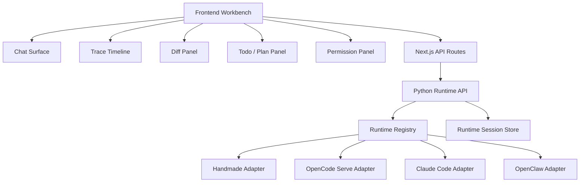

# Agent Runtime Workbench 通用架构文档

## 1. 背景

当前项目已经从单一手写 Agent 演进为 Runtime Adapter 架构：

- `handmade`：项目内置手写 Agent。
- `opencode`：外部成熟 coding agent runtime，已从 CLI `run` MVP 升级到 `opencode serve` 方案。
- `claude-code`：通过 Claude Code headless CLI `stream-json` 接入，作为第二个成熟 runtime adapter。

用户目标已经从“能切换 Agent”升级为：

```text
让项目具备完整 OpenCode 能力，对齐甚至超过 OpenCode 体验；
同时为后续 Claude Code、OpenClaw、Hermes 等 Agent 框架提供通用接入能力。
```

因此项目不能只做 OpenCode UI 复刻，而应该建设一个统一的 Agent Runtime Workbench：

```text
一个前端工作台
多个底层 runtime
统一事件协议
统一 artifact 模型
统一 session/workspace/permission 管理
runtime-specific 能力渐进增强
```

## 2. 设计结论

项目应定位为：

```text
Multi-runtime Agent Workbench
```

而不是：

```text
OpenCode Web UI clone
```

OpenCode 是第一套重点对齐的强 runtime，但前端主协议不能绑定 OpenCode。Claude Code、OpenClaw 等未来 runtime 都应通过 adapter 翻译成项目统一协议。

推荐架构：

```text
Next.js Frontend Workbench
  -> Next.js API Routes
    -> Python Backend Runtime API
      -> Runtime Registry
        -> Handmade Adapter
        -> OpenCode Serve Adapter
        -> Claude Code Adapter
        -> OpenClaw Adapter
```

核心原则：

- 前端不直接调用 OpenCode / Claude Code / OpenClaw。
- 后端 adapter 负责 runtime-specific 协议翻译。
- 前端只消费统一 `RuntimeEvent v1`。
- 文件 diff、todo、permission、trace 等统一建模为 `RuntimeArtifact v1`。
- runtime 特有能力通过 `capabilities` 暴露，前端渐进展示。

## 3. 目标

### 3.1 用户体验目标

- 对齐 OpenCode 原生 coding agent 的核心体验。
- 支持完整工具过程可视化，而不是只看最终答案。
- 支持文件 diff review。
- 支持 todo/plan 面板。
- 支持权限请求和批准/拒绝。
- 支持任务中止、继续、恢复。
- 支持同一任务在多个 runtime 间比较。
- 后续允许某些体验超过原生 OpenCode。

### 3.2 技术目标

- 定义稳定 `RuntimeEvent v1`。
- 定义稳定 `RuntimeArtifact v1`。
- 定义稳定 `RuntimeCapabilities v1`。
- 定义 `RuntimeSessionRef`，保存本地 session 与外部 runtime session 映射。
- 保留 `handmade` 作为默认和回滚路径。
- 所有 runtime adapter 可独立演进。
- `claude-code` 第一版直接调用原生 `claude -p --output-format stream-json`，不裁剪内置工具；前端仍只消费统一事件。

## 4. 非目标

- 不在本阶段实现所有 runtime。
- 不把 OpenCode 的内部事件 schema 直接暴露给前端。
- 不要求 Claude Code / OpenClaw 立刻具备 OpenCode 的所有 artifact。
- 不在当前单用户 demo 里完成完整多租户隔离。
- 不为每个 runtime 单独做一套页面。

## 5. 总体架构



前端工作台由多个面板组成，但它们都消费统一数据：

```text
RuntimeEvent
RuntimeArtifact
RuntimeSessionRef
RuntimeCapabilities
```

## 6. 核心对象

### 6.1 Runtime

Runtime 是底层 Agent 执行器。

示例：

```text
handmade
opencode
claude-code
openclaw
hermes
```

Runtime 负责：

- 接收用户消息。
- 调用模型。
- 编排工具。
- 管理上下文或 session。
- 产出事件和 artifact。

### 6.2 Runtime Adapter

Adapter 是项目与外部 runtime 的边界。

职责：

- 检测 runtime 是否可用。
- 管理外部进程或 server。
- 维护 session 映射。
- 把外部事件翻译成 `RuntimeEvent v1`。
- 把外部产物翻译成 `RuntimeArtifact v1`。
- 将错误、超时、中止统一化。

### 6.3 Runtime Session

本地会话和外部 runtime 会话是两个概念。

```text
localSessionId: session-xxx
runtimeId: opencode
externalSessionId: ses_xxx
workspace: /app
```

第一版可以内存保存，后续应持久化。

### 6.4 Runtime Artifact

Artifact 是 runtime 执行过程中产生的结构化产物。

示例：

- tool call
- command output
- file diff
- todo list
- permission request
- diagnostic
- trace span
- generated file

## 7. RuntimeEvent v1

前端主通道继续使用 SSE。

事件分层：

```text
Lifecycle Events
Text Events
Reasoning Events
Tool Events
Artifact Events
Permission Events
Session Events
Error Events
```

### 7.1 Lifecycle Events

```text
message_start
message_done
message_stopped
```

`message_start`：

```json
{
  "id": "assistant-trace_xxx",
  "trace_id": "trace_xxx",
  "runtime": "opencode",
  "model": "deepseek/deepseek-v4-pro",
  "session_ref": {
    "local_session_id": "session_xxx",
    "runtime_session_id": "ses_xxx"
  }
}
```

`message_done`：

```json
{
  "answer": "最终回答",
  "steps": [],
  "artifacts": [],
  "runtime": "opencode",
  "model": "deepseek/deepseek-v4-pro",
  "trace_id": "trace_xxx"
}
```

### 7.2 Text Events

```text
text_delta
```

```json
{
  "delta": "现在是",
  "message_id": "msg_xxx",
  "part_id": "prt_xxx"
}
```

要求：

- 前端聊天正文只拼接 `text_delta`。
- 不把 reasoning 当最终回答展示，除非用户打开调试面板。

### 7.3 Reasoning Events

```text
reasoning_delta
reasoning_done
```

```json
{
  "delta": "The user wants current time...",
  "message_id": "msg_xxx",
  "part_id": "prt_xxx",
  "visibility": "debug"
}
```

第一版可以只进入 Trace Debug 面板，不在主聊天正文显示。

### 7.4 Tool Events

```text
tool_start
tool_delta
tool_result
tool_error
```

统一 `ToolStep`：

```json
{
  "id": "call_xxx",
  "type": "tool",
  "status": "running",
  "tool": "bash",
  "args": {
    "command": "date"
  },
  "result": null,
  "error": null,
  "permission": "runtime-native",
  "started_at": 1777998707499,
  "ended_at": null,
  "duration_ms": null,
  "runtime": "opencode",
  "raw": {}
}
```

工具状态：

```text
pending
running
success
error
cancelled
awaiting_approval
```

### 7.5 Artifact Events

```text
artifact_created
artifact_updated
artifact_removed
```

```json
{
  "artifact": {
    "id": "artifact_xxx",
    "type": "diff",
    "runtime": "opencode",
    "title": "README.md",
    "status": "ready",
    "data": {}
  }
}
```

Artifact 不直接塞进 message content，而是进入右侧面板或下方 tabs。

### 7.6 Permission Events

```text
permission_request
permission_result
```

`permission_request`：

```json
{
  "id": "perm_xxx",
  "runtime": "opencode",
  "tool": "bash",
  "args": {
    "command": "git push"
  },
  "risk": "high",
  "options": ["once", "always", "reject"]
}
```

`permission_result`：

```json
{
  "id": "perm_xxx",
  "response": "once"
}
```

当前用户希望 OpenCode 原生能力全开，所以 OpenCode 第一版可以默认 allow。统一 permission UI 仍应作为通用能力设计。

### 7.7 Session Events

```text
session_status
session_diff
session_todo
```

`session_status`：

```json
{
  "runtime": "opencode",
  "status": "busy",
  "local_session_id": "session_xxx",
  "runtime_session_id": "ses_xxx"
}
```

状态值：

```text
idle
busy
aborting
error
disconnected
```

### 7.8 Error Events

```text
error
```

```json
{
  "message": "OpenCode server 不可用",
  "runtime": "opencode",
  "recoverable": true,
  "code": "RUNTIME_UNAVAILABLE"
}
```

## 8. RuntimeArtifact v1

统一 artifact 类型：

```ts
type RuntimeArtifactType =
  | "tool_call"
  | "command_output"
  | "file_diff"
  | "todo"
  | "permission"
  | "diagnostic"
  | "trace"
  | "file"
  | "link";
```

基础结构：

```ts
type RuntimeArtifact = {
  id: string;
  type: RuntimeArtifactType;
  runtime: string;
  title: string;
  status: "pending" | "running" | "ready" | "error" | "stale";
  messageId?: string;
  stepId?: string;
  createdAt: number;
  updatedAt?: number;
  data: unknown;
  raw?: unknown;
};
```

### 8.1 File Diff Artifact

```json
{
  "id": "diff_README.md",
  "type": "file_diff",
  "title": "README.md",
  "status": "ready",
  "data": {
    "path": "README.md",
    "status": "modified",
    "added": 12,
    "removed": 4,
    "patch": "..."
  }
}
```

### 8.2 Todo Artifact

```json
{
  "id": "todo_session_xxx",
  "type": "todo",
  "title": "Plan",
  "status": "ready",
  "data": {
    "items": [
      { "id": "1", "content": "Inspect repo", "status": "completed" },
      { "id": "2", "content": "Edit files", "status": "running" }
    ]
  }
}
```

### 8.3 Command Output Artifact

```json
{
  "id": "cmd_call_xxx",
  "type": "command_output",
  "title": "date",
  "status": "ready",
  "data": {
    "command": "date",
    "stdout": "Wed May 6 00:31:47 CST 2026",
    "stderr": "",
    "exitCode": 0
  }
}
```

## 9. RuntimeCapabilities v1

Capabilities 分为通用能力和 runtime-specific 能力。

```ts
type RuntimeCapabilities = {
  text: boolean;
  stream: boolean;
  reasoning?: boolean;
  toolEvents: boolean;
  toolDelta?: boolean;
  toolApproval: boolean;
  fileRead: boolean;
  fileWrite: boolean;
  shell: boolean;
  webFetch?: boolean;
  webSearch?: boolean;
  subAgent?: boolean;
  diff?: boolean;
  todo?: boolean;
  nativeSession?: boolean;
  abort?: boolean;
  resume?: boolean;
  compare?: boolean;
  workspaceScope?: "project" | "container" | "machine" | "remote";
  rawEvents?: boolean;
};
```

前端规则：

- 只根据 capabilities 渐进展示 UI。
- 不因为某 runtime 没有某能力而破坏主聊天体验。
- runtime-specific 能力放入扩展面板，不污染主输入区。

## 10. RuntimeSessionRef

第一版内存结构：

```python
{
  "local_session_id": "session_xxx",
  "runtime_id": "opencode",
  "external_session_id": "ses_xxx",
  "workspace": "/app",
  "model": "deepseek/deepseek-v4-pro",
  "created_at": 1777998707000,
  "updated_at": 1777998708000
}
```

后续 SQLite 表：

```sql
create table runtime_sessions (
  local_session_id text not null,
  runtime_id text not null,
  external_session_id text not null,
  workspace text,
  model text,
  created_at integer not null,
  updated_at integer not null,
  primary key (local_session_id, runtime_id)
);
```

## 11. 前端工作台布局

目标不是做更多卡片，而是把 coding agent 的关键状态放到稳定位置。

推荐布局：

```text
┌───────────────────────────────────────────────┐
│ Top Bar: Session / Runtime / Model / Status   │
├───────────────┬───────────────────────────────┤
│ Sessions      │ Chat Surface                  │
│ Runtime List  │                               │
│ Context       │                               │
├───────────────┴───────────────┬───────────────┤
│ Composer                       │ Right Panel   │
│ RuntimePicker / ModelPicker    │ Trace/Diff    │
└───────────────────────────────┴───────────────┘
```

右侧面板 tabs：

```text
Trace
Tools
Diff
Todo
Files
Permissions
Runtime Debug
```

移动端：

- 右侧面板改为 bottom sheet。
- 工具时间线可折叠。
- Diff 默认全屏查看。

## 12. 对齐 OpenCode 的能力清单

| 能力 | 当前状态 | Workbench 目标 |
| --- | --- | --- |
| 原生 session | 已有初版 | 持久化映射 |
| 原生 SSE event | 已有初版 | 完整事件映射 |
| 工具调用 | 已有基础卡片 | 完整工具 timeline |
| Bash output | 基础 result | 支持 streaming output / stdout / stderr |
| File edit | OpenCode 可执行 | 前端展示 diff 和变更摘要 |
| Diff | server 可用 | 右侧 Diff panel |
| Todo | server 可用 | Todo panel |
| Permission | 当前 allow-all | 通用审批 UI |
| Abort | server 可用 | 前端停止真正调用 runtime abort |
| Resume | session 可复用 | 后端重启后可恢复 |
| Runtime debug | 暂无 | Raw event viewer |

## 13. 超过 OpenCode 的体验机会

### 13.1 多 Runtime 对比

同一任务可以发给多个 runtime：

```text
OpenCode
Claude Code
Handmade
```

比较：

- 最终回答。
- 修改文件数。
- diff 大小。
- 工具调用次数。
- 耗时。
- 错误率。

### 13.2 统一 Trace 回放

不管底层 runtime 是谁，都能回放：

```text
user prompt
model text delta
reasoning delta
tool start/result
file diff
permission decision
final answer
```

### 13.3 更强 Diff Review

在 OpenCode diff 基础上增加：

- 文件级接受/拒绝。
- hunk 级接受/拒绝。
- 一键 revert 某个 artifact。
- 自动生成变更摘要。
- 自动生成测试建议。

### 13.4 Runtime 推荐

根据任务类型推荐 runtime：

| 任务 | 推荐 runtime |
| --- | --- |
| 项目代码修改 | OpenCode / Claude Code |
| 本机自动化 | OpenClaw |
| 轻量问答和工具调用 | Handmade |
| 复杂规划 | Claude Code / OpenCode |

### 13.5 跨 Runtime 共享项目记忆

统一维护：

- 项目技术栈。
- 代码结构摘要。
- 用户偏好。
- 已确认决策。
- 部署环境。

不同 runtime 通过 adapter 获取这些上下文，而不是各自从零理解项目。

## 14. Adapter 接入规范

每个 runtime adapter 必须实现：

```python
class AgentRuntime:
    id: str
    label: str
    description: str
    capabilities: dict
    supported_model_ids: list[str]

    def available(self) -> bool: ...
    def unavailable_reason(self) -> str: ...
    def version(self) -> str | None: ...
    def public_info(self, default_runtime_id: str) -> dict: ...
    def run(self, request: RuntimeRequest, event_sink: EventSink | None = None) -> RuntimeResult: ...
```

建议新增：

```python
def abort(self, local_session_id: str) -> None: ...
def list_artifacts(self, local_session_id: str) -> list[RuntimeArtifact]: ...
def get_artifact(self, artifact_id: str) -> RuntimeArtifact: ...
```

第一版可以不改 base class，先在具体 adapter 中实现，等第二个外部 runtime 接入时再固化。

## 15. Claude Code 接入

当前已接入 Claude Code headless CLI：

```text
claude -p --output-format stream-json --include-partial-messages
```

当前模型选择表达底层模型，runtime 选择表达执行框架。因此 Claude Code 复用全局模型选项：

- `deepseek-v4-pro`
- `deepseek-v4-flash`
- `mimo-v2.5-pro`
- `mimo-v2.5`

Claude Code adapter 内部会把 `deepseek-v4-pro` 映射为 DeepSeek Anthropic API 的 `deepseek-v4-pro[1m]`，通过 `DEEPSEEK_API_KEY` 免 Claude 官方登录运行。
MiMo 模型通过小米 Anthropic API 运行，使用 `MIMO_API_KEY`，默认端点由 `MIMO_BASE_URL=https://token-plan-sgp.xiaomimimo.com/v1` 推导为 `https://token-plan-sgp.xiaomimimo.com/anthropic`。

DeepSeek 分支启动 Claude Code 子进程时会注入：

```text
ANTHROPIC_BASE_URL=https://api.deepseek.com/anthropic
ANTHROPIC_API_KEY=$DEEPSEEK_API_KEY
ANTHROPIC_AUTH_TOKEN=$DEEPSEEK_API_KEY
ANTHROPIC_DEFAULT_SONNET_MODEL=deepseek-v4-pro[1m]
ANTHROPIC_DEFAULT_HAIKU_MODEL=deepseek-v4-flash
CLAUDE_CODE_SUBAGENT_MODEL=deepseek-v4-flash
```

MiMo 分支启动 Claude Code 子进程时会注入：

```text
ANTHROPIC_BASE_URL=https://token-plan-sgp.xiaomimimo.com/anthropic
ANTHROPIC_API_KEY=$MIMO_API_KEY
ANTHROPIC_AUTH_TOKEN=$MIMO_API_KEY
ANTHROPIC_DEFAULT_OPUS_MODEL=mimo-v2.5-pro
ANTHROPIC_DEFAULT_SONNET_MODEL=mimo-v2.5-pro
ANTHROPIC_DEFAULT_HAIKU_MODEL=mimo-v2.5
CLAUDE_CODE_SUBAGENT_MODEL=mimo-v2.5
```

同时使用 `--setting-sources project,local`，避免本机或服务器上的用户级 Claude Code 全局配置覆盖项目内的 DeepSeek 配置。

接入原则：

- 不直接让前端消费 Claude Code 私有事件。
- 先翻译为 `RuntimeEvent v1`。
- 特有能力进入 `RuntimeArtifact` 或 runtime-specific debug panel。

## 16. OpenClaw 接入预留

OpenClaw 权限面可能比 OpenCode 更大，尤其是本机自动化、GUI、跨目录操作。

建议：

- 不直接跑在主 VPS 宿主机。
- 优先容器或独立机器。
- workspace / home / secrets 明确隔离。
- adapter 必须声明 `workspaceScope`。
- permission 和 trace 必须先具备基础能力再开放给外部用户。

OpenClaw adapter 可能形态：

```text
OpenClaw server/API
OpenClaw CLI subprocess
OpenClaw PTY session
```

## 17. 安全边界

用户当前希望 OpenCode 能力完整开放，这是单用户 demo 阶段可以接受的产品选择。

但 Workbench 架构必须区分：

```text
能力开放
部署隔离
用户授权
审计回放
```

原则：

- 不在 adapter 中随意阉割 runtime 能力。
- 用 workspace/container/VPS 隔离控制风险半径。
- 用 permission UI 控制高风险动作。
- 用 trace/artifact 做事后可审计。
- 多用户前不得共享同一个高权限 runtime server。

## 18. 数据持久化演进

当前 localStorage + 后端内存映射可以支撑 demo。

触发 SQLite 的条件：

- 需要后端重启后恢复 runtime session。
- 需要保存 artifact。
- 需要保存 trace。
- 需要跨设备访问会话。
- 需要多用户。

建议表：

```text
runtime_sessions
runtime_events
runtime_artifacts
runtime_permissions
workspace_snapshots
```

第一阶段只做 `runtime_sessions` 即可。

## 19. 开发路线

### Phase A：OpenCode 体验对齐

目标：让 OpenCode 在当前前端里接近原生体验。

任务：

- 完整映射 OpenCode tool events。
- 工具卡片支持 bash/read/edit/grep/glob/webfetch/websearch。
- 接 `/session/:id/diff` 并做 Diff panel。
- 接 `/session/:id/todo` 并做 Todo panel。
- 前端 stop 调用 runtime abort。
- Runtime session 映射持久化。

验收：

- OpenCode 修改文件后，前端能看到 diff。
- OpenCode 执行 bash 后，前端能看到 command、stdout、exit code。
- OpenCode 运行中点击停止，runtime 真正停止。
- 刷新页面后仍能继续同一 OpenCode session。

### Phase B：Workbench 通用协议固化

目标：让第二个外部 runtime 可以低成本接入。

任务：

- 固化 `RuntimeEvent v1`。
- 固化 `RuntimeArtifact v1`。
- 固化 `RuntimeCapabilities v1`。
- 增加 Raw Event debug panel。
- 增加 artifact store。

验收：

- 前端不依赖 OpenCode 专属字段。
- Adapter 单测覆盖事件翻译。
- 可以 mock 一个 fake runtime 验证工作台 UI。

### Phase C：接入 Claude Code

目标：验证通用架构是否真的不绑定 OpenCode。

任务：

- 调研 Claude Code 可编程接口。
- 实现 `claude-code` adapter MVP。
- 复用 Chat / Trace / Tool / Diff UI。

验收：

- 同一个 prompt 可在 OpenCode 和 Claude Code 间切换运行。
- 前端不新增 Claude Code 专属主页面。

### Phase D：接入 OpenClaw

目标：验证高权限自动化 runtime 接入。

任务：

- 明确沙箱/容器边界。
- 实现 OpenClaw adapter。
- 接入 permission / trace / artifact。

验收：

- OpenClaw 可以被选择。
- 高风险能力可审计。
- 不影响 OpenCode 和 handmade。

### Phase E：超过单 runtime 体验

目标：形成项目差异化。

任务：

- 多 runtime 对比运行。
- 自动 runtime 推荐。
- 跨 runtime 项目记忆。
- Diff review 增强。
- Trace 回放。

## 20. 验收矩阵

| 能力 | OpenCode | Claude Code | OpenClaw | Handmade |
| --- | --- | --- | --- | --- |
| Chat | 必须 | 必须 | 必须 | 已有 |
| Text stream | 必须 | 必须 | 应支持 | 已有 |
| Tool events | 必须 | 必须 | 必须 | 已有 |
| File diff | 必须 | 应支持 | 应支持 | 可选 |
| Todo / Plan | 必须 | 应支持 | 可选 | 可选 |
| Permission | 后续 | 后续 | 必须 | 已有 |
| Abort | 必须 | 必须 | 必须 | 后续 |
| Session resume | 必须 | 应支持 | 应支持 | 已有本地会话 |
| Raw debug | 必须 | 必须 | 必须 | 可选 |

## 21. 工程约束

- 主聊天协议不能出现 OpenCode 专属字段作为必填。
- runtime-specific 字段只能放在 `raw` 或 `artifact.data`。
- Adapter 必须有单测，不依赖真实外部 runtime。
- 真实 runtime smoke test 可以作为手工/集成验证。
- 外部 runtime 不可用时必须 `available=false` 或返回清晰错误。
- `handmade` runtime 永远保留。

## 22. 结论

下一步不应该继续只修 OpenCode 的单点体验，而应该进入 Workbench 化：

1. 先用 OpenCode 补齐工具 timeline、diff、todo、abort、session resume。
2. 在这个过程中固化 `RuntimeEvent v1` 和 `RuntimeArtifact v1`。
3. 再接 Claude Code 验证通用性。
4. 最后接 OpenClaw 这类更高权限 runtime。

这样项目会从“一个套壳 OpenCode 的前端”成长为“多 Agent Runtime 工作台”。OpenCode 是第一块大石头，但不是天花板。
