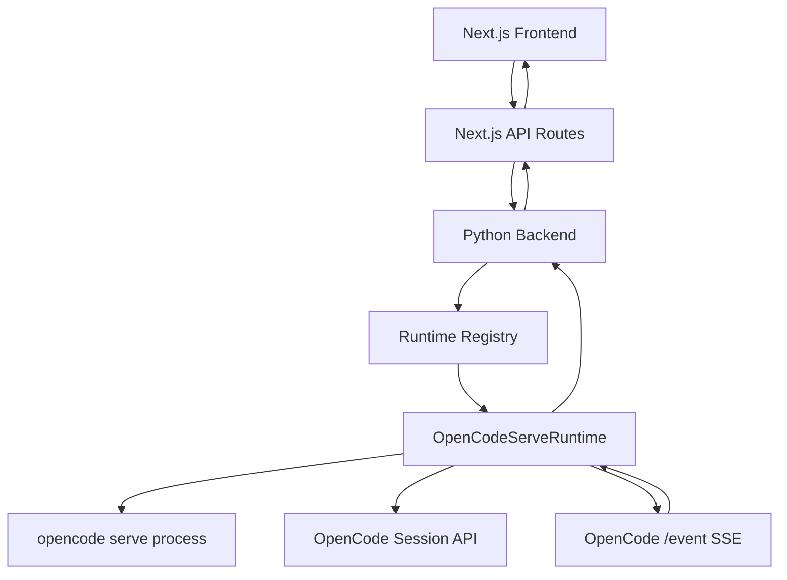
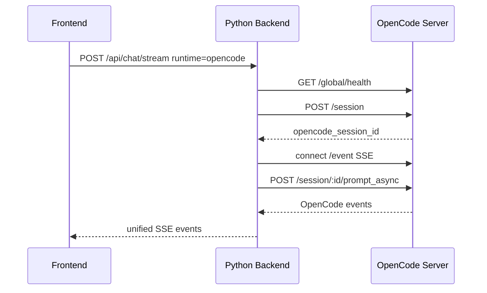

# OpenCode Serve Adapter 技术方案

## 1. 背景

当前项目已经具备 Runtime Adapter 抽象，并已接入：

- `handmade`：项目内置手写 Agent。
- `opencode`：通过 `opencode run --format json` 调用 OpenCode CLI 的 MVP adapter。

CLI `run` 模式已经能证明 OpenCode 可以被当前前端调用，但它有明显体验问题：

- 最终回答不稳定逐 token 输出，通常按 OpenCode JSON 事件批量返回。
- OpenCode 原生工具事件没有完整映射到前端工具卡片。
- 每次请求都是一次独立 CLI run，无法稳定复用 OpenCode session。
- 中止、继续、diff、todo、permission response 等 OpenCode 原生能力难以接入。

因此下一步建议将 `opencode` adapter 从 CLI `run` 模式升级为 `opencode serve` 模式。

## 2. 设计结论

升级方向是正确的，但不能让前端直接对接 OpenCode server。

推荐架构：

```text
Next.js 前端
  -> Next.js API Routes
    -> Python 后端 /api/chat/stream
      -> Runtime Registry
        -> handmade adapter
        -> opencode serve adapter
        -> future openclaw adapter
        -> future claude-code adapter
```

不推荐：

```text
Next.js 前端
  -> OpenCode server
```

原因：

- 前端会被 OpenCode 的 session/message/event 协议绑定。
- 后续接 OpenClaw、Claude Code、Hermes 时需要重写前端。
- 当前会话、模型选择、上下文估算、消息展示和 RuntimePicker 会失去统一入口。

OpenCode 应该是一个 Runtime Adapter，而不是项目新的主协议。

更上层的多 runtime 工作台协议、Artifact 模型、前端面板和 Claude Code / OpenClaw 兼容策略，见：[Agent Runtime Workbench 通用架构文档](./agent-runtime-workbench-architecture.md)。

## 3. 官方能力依据

OpenCode 官方文档中 `opencode serve` 会启动 headless HTTP server，用于程序化访问 OpenCode。

关键能力：

- `opencode serve --port <number> --hostname <string>`
- `GET /global/health` 获取健康状态和版本。
- `GET /event` 或 `GET /global/event` 获取 SSE 事件流。
- `POST /session` 创建 session。
- `POST /session/:id/prompt_async` 异步发送消息。
- `POST /session/:id/message` 发送消息并等待响应。
- `POST /session/:id/abort` 中止运行。
- `GET /session/:id/message` 获取消息列表。
- `GET /session/:id/diff` 获取 diff。
- `POST /session/:id/permissions/:permissionID` 响应 permission request。

参考：

- <https://dev.opencode.ai/docs/server>
- <https://dev.opencode.ai/docs/sdk>
- <https://dev.opencode.ai/docs/cli>

## 4. 目标

### 4.1 产品目标

- 前端继续使用同一套聊天页面。
- Runtime 选择 `OpenCode` 后，尽量呈现原生 OpenCode 能力。
- OpenCode 运行过程中的工具调用、文本输出、错误和完成事件尽量可见。
- 后续可以接入 OpenClaw、Claude Code 等其他 runtime，而不是为 OpenCode 写死前端。

### 4.2 技术目标

- 用常驻 OpenCode server 替代每次 `opencode run` 子进程。
- 建立项目 session 与 OpenCode session 的映射。
- 后端订阅 OpenCode SSE event，并翻译成项目统一 SSE event。
- 保留 `/api/chat/stream` 对前端的稳定协议。
- 保留 `handmade` 默认可回滚能力。

## 5. 非目标

- 不在本阶段实现 OpenClaw 或 Claude Code adapter。
- 不在本阶段做多用户隔离。
- 不把 OpenCode server 直接暴露给公网。
- 不要求把 OpenCode 所有内部事件一次性做成完美 UI。
- 不重写现有 `handmade` Agent。

## 6. 总体架构



前端仍然只接收项目统一事件：

```text
message_start
text_delta
tool_start
tool_result
tool_error
tool_awaiting_approval
message_done
error
```

OpenCode adapter 负责把 OpenCode 原生事件翻译成这套协议。

## 7. 文件结构

建议新增或调整：

```text
runtimes/
  opencode.py                 # 可保留 CLI MVP 或重命名为 opencode_cli.py
  opencode_serve.py           # 新增 serve adapter
  opencode_events.py          # 可选，事件翻译逻辑
  opencode_process.py         # 可选，进程生命周期管理

tests/
  test_opencode_serve_runtime.py
```

推荐第一版最小实现：

```text
runtimes/opencode_serve.py
```

如果文件过大，再拆 `events/process`。

## 8. Runtime Capabilities

`opencode serve` adapter 对外声明：

```python
capabilities = {
    "text": True,
    "stream": True,
    "toolEvents": True,
    "toolApproval": True,
    "fileRead": True,
    "fileWrite": True,
    "shell": True,
    "webFetch": True,
    "webSearch": True,
    "subAgent": True,
    "diff": True,
    "todo": True,
    "nativeSession": True,
}
```

注意：这里是“OpenCode 原生能力存在”，不代表当前前端第一版全部展示完整。前端展示能力可分阶段补。

## 9. 配置项

新增环境变量：

```text
OPENCODE_BIN=opencode
OPENCODE_SERVER_HOST=127.0.0.1
OPENCODE_SERVER_PORT=4096
OPENCODE_SERVER_URL=
OPENCODE_SERVER_PASSWORD=
OPENCODE_SERVER_USERNAME=opencode
OPENCODE_WORKSPACE=/app
OPENCODE_START_SERVER=true
OPENCODE_REQUEST_TIMEOUT_MS=120000
OPENCODE_EVENT_TIMEOUT_MS=120000
OPENCODE_MODEL=deepseek/deepseek-v4-pro
```

含义：

| 变量 | 说明 |
| --- | --- |
| `OPENCODE_BIN` | OpenCode CLI 路径。 |
| `OPENCODE_SERVER_HOST` | 本地 serve host，默认只监听 `127.0.0.1`。 |
| `OPENCODE_SERVER_PORT` | OpenCode server 端口。 |
| `OPENCODE_SERVER_URL` | 如果已有外部 OpenCode server，则直接连接。 |
| `OPENCODE_SERVER_PASSWORD` | Basic auth 密码。 |
| `OPENCODE_SERVER_USERNAME` | Basic auth 用户名。 |
| `OPENCODE_WORKSPACE` | OpenCode 运行工作区。 |
| `OPENCODE_START_SERVER` | 是否由 adapter 自动启动 server。 |
| `OPENCODE_MODEL` | OpenCode provider/model，优先级高于前端模型映射。 |

## 10. 进程生命周期

### 10.1 本地开发

本地开发建议由 adapter 自动启动：

```bash
opencode serve --hostname 127.0.0.1 --port 4096
```

启动策略：

1. 访问 `/global/health`。
2. 如果健康，复用现有 server。
3. 如果不健康且 `OPENCODE_START_SERVER=true`，启动子进程。
4. 等待 health ready，超时则 runtime `available=false`。

### 10.2 Docker 部署

推荐第一版仍然让 backend 容器内启动 OpenCode server 子进程。

后续更稳的部署方式：

```text
backend container
opencode container
```

用 Docker network 连接：

```text
OPENCODE_SERVER_URL=http://opencode:4096
```

但第一版多一个容器会增加部署复杂度，可以先不拆。

### 10.3 进程退出

backend 退出时应清理由自己启动的 OpenCode server 子进程。

如果连接的是外部 server，不负责关闭。

## 11. Session 映射

当前前端会话 ID：

```text
ChatSession.id
```

OpenCode session ID：

```text
ses_xxx
```

需要后端建立映射：

```python
opencode_session_map = {
    frontend_session_id: opencode_session_id
}
```

第一版可以先用内存映射。

缺点：

- backend 重启后映射丢失。
- 旧前端会话会新建 OpenCode session。

可接受，因为当前项目会话本身也主要是 localStorage。

后续如果引入 SQLite，可以持久化：

```sql
runtime_sessions(
  local_session_id text,
  runtime_id text,
  external_session_id text,
  created_at integer,
  updated_at integer
)
```

## 12. 请求流程

### 12.1 首次发送消息



### 12.2 后续发送消息

复用 `frontend_session_id -> opencode_session_id` 映射：

```text
POST /session/:opencode_id/prompt_async
```

## 13. Prompt 构造

当前 CLI adapter 会把最近 messages 拼成一个 prompt。Serve adapter 应减少这种二次拼接，优先交给 OpenCode 自己维护 session。

第一条消息：

```json
{
  "parts": [
    { "type": "text", "text": "用户输入" }
  ],
  "model": {
    "providerID": "deepseek",
    "modelID": "deepseek-v4-pro"
  }
}
```

具体字段以 OpenCode server OpenAPI spec 为准。

如果 server API 要求 `model` 是字符串，则 adapter 内部转换。

不建议每次把完整历史 messages 再塞给 OpenCode，因为 OpenCode session 已经负责上下文。

## 14. Model 映射

项目模型 ID：

```text
deepseek-v4-pro
```

OpenCode 模型 ID：

```text
deepseek/deepseek-v4-pro
```

adapter 内部继续保留映射：

```python
{
    "deepseek-v4-flash": ("deepseek", "deepseek-v4-flash"),
    "deepseek-v4-pro": ("deepseek", "deepseek-v4-pro"),
    "deepseek-v4-pro-thinking": ("deepseek", "deepseek-reasoner"),
}
```

如果 `OPENCODE_MODEL` 已配置，则优先使用它。

小米 MiMo、智谱、万擎是否能走 OpenCode，取决于 OpenCode providers/models.dev 是否支持，不能默认复用项目里的 OpenAI-compatible provider 配置。

## 15. 事件翻译

OpenCode `/event` 是原生 SSE。adapter 要过滤当前 session 的事件，并翻译成项目事件。

### 15.1 文本事件

OpenCode part：

```json
{
  "type": "text",
  "part": {
    "type": "text",
    "text": "..."
  }
}
```

翻译：

```text
text_delta { delta }
```

### 15.2 工具开始

OpenCode `tool_use` 或 tool part 状态开始：

```text
tool_start
```

项目 `ToolStep`：

```json
{
  "id": "call_xxx",
  "type": "tool",
  "status": "running",
  "tool": "bash",
  "args": { "command": "date" },
  "permission": "opencode-native"
}
```

### 15.3 工具完成

OpenCode tool state completed：

```text
tool_result
```

项目 `ToolStep`：

```json
{
  "id": "call_xxx",
  "status": "success",
  "result": {
    "output": "...",
    "exit": 0
  }
}
```

### 15.4 工具失败

OpenCode tool state error：

```text
tool_error
```

### 15.5 Permission

如果 OpenCode event 里出现 permission request：

```text
tool_awaiting_approval
```

第一版可以有两个选择：

1. 原生全自动：使用 OpenCode 自己的 allow 策略，不展示 permission。
2. UI 审批：映射到当前工具审批卡片，再调用 `POST /session/:id/permissions/:permissionID`。

用户当前要求“不要禁止 opencode 的任何能力”，所以第一版建议：

```text
OPENCODE_PERMISSION=allow-all equivalent
```

优先跑通原生能力；审批 UI 放到后续版本。

### 15.6 完成事件

OpenCode 当前 message 完成后：

```text
message_done { answer, steps, runtime, model, trace_id }
```

如果 `/event` 没有明确 done，需要 adapter 结合 `prompt_async` 运行状态、message parts 或 session status 判断。

## 16. 中止生成

前端点击停止：

```text
AbortController abort
```

当前 Python handler 捕获连接断开后，应调用：

```text
POST /session/:id/abort
```

第一版可以在 `except BrokenPipeError / ConnectionResetError` 里触发。

后续应增加显式：

```text
POST /api/runtimes/opencode/sessions/:id/abort
```

## 17. Diff 与文件变更

OpenCode 原生支持 session diff。

后续可增加：

```text
GET /api/runtime/opencode/session/:localSessionId/diff
```

内部调用：

```text
GET /session/:opencodeSessionId/diff
```

第一版不做 diff UI，但必须保留 external session ID，方便后续扩展。

## 18. 多 Runtime 兼容策略

为了后续兼容 OpenClaw、Claude Code，不把 OpenCode 的概念泄漏到前端主协议。

### 18.1 统一层

所有 runtime 必须实现：

```python
class AgentRuntime:
    def available(self) -> bool: ...
    def unavailable_reason(self) -> str: ...
    def public_info(self, default_runtime_id: str) -> dict: ...
    def run(self, request: RuntimeRequest, event_sink: EventSink | None = None) -> RuntimeResult: ...
```

建议后续补：

```python
def abort(self, local_session_id: str) -> None: ...
```

### 18.2 Runtime 私有能力

不要强迫所有 runtime 实现 OpenCode 的 diff/todo/permission。

用 capabilities 声明：

```json
{
  "diff": true,
  "todo": true,
  "nativePermission": true
}
```

前端按 capability 渐进展示。

### 18.3 OpenClaw 预留

OpenClaw 如果有 server/API：

```text
OpenClaw server -> OpenClawAdapter -> unified SSE
```

如果只有 CLI：

```text
OpenClaw CLI -> PTY/subprocess -> unified SSE
```

OpenClaw 权限面通常更大，部署上建议独立容器或独立机器。

### 18.4 Claude Code 预留

Claude Code 更适合通过 CLI/PTY 或官方可编程接口接入。

注意：

- 账号态、认证、ToS 需要单独评估。
- 不建议把 Claude Code 的私有协议直接暴露到前端。
- 如果接入，仍然只作为 `claude-code` adapter。

## 19. 安全与产品边界

用户当前希望 OpenCode 原生能力全开，所以 adapter 不主动禁用 OpenCode 工具。

但需要明确边界：

- OpenCode server 不对公网暴露，只监听 `127.0.0.1` 或 Docker 内网。
- OpenCode 的工作目录默认是项目目录或容器 `/app`。
- VPS 部署时不要把宿主机 `/home/admin`、`.ssh`、云厂商密钥目录挂给 OpenCode。
- `.env.production` 是否能被 OpenCode 读到，取决于运行环境。若未来开放给外部用户，必须重新设计隔离。
- 第一版是单用户 demo，不满足多人共享安全要求。

这不是在 adapter 里禁止能力，而是在部署边界上控制 blast radius。

## 20. 测试方案

### 20.1 单测

新增：

```text
tests/test_opencode_serve_runtime.py
```

覆盖：

- server URL 构造。
- health 成功/失败。
- session 映射创建。
- model 映射。
- OpenCode text event -> `text_delta`。
- OpenCode tool event -> `tool_start/tool_result`。
- error event -> `error`。
- abort 调用。

这些测试应 mock HTTP，不依赖真实 OpenCode。

### 20.2 集成 smoke test

本机安装 OpenCode 后：

```bash
curl http://127.0.0.1:8000/api/runtimes
```

```bash
curl -N http://127.0.0.1:8000/api/chat/stream \
  -H "content-type: application/json" \
  -d '{"runtime":"opencode","model":"deepseek-v4-pro","messages":[{"role":"user","content":"现在几点了？"}]}'
```

预期：

- 返回 `message_start`。
- 至少出现一次 `tool_start/tool_result` 或 OpenCode 原生工具事件映射。
- 返回 `text_delta`。
- 返回 `message_done`。

### 20.3 前端手工验证

- 选择 OpenCode。
- 发送“现在几点了？”。
- 看到工具调用卡片或至少看到回答来源为 OpenCode。
- 发送“修改 README 中某一句话”。
- OpenCode 能执行文件修改。
- 页面刷新后，同一前端 session 继续映射到同一 OpenCode session。第一版如果 backend 重启，允许丢失映射。

## 21. 实施步骤

### Step 1：新增 OpenCode server client

- 在 `runtimes/opencode_serve.py` 中实现 HTTP helper。
- 支持 Basic auth。
- 支持 health check。

验证：

```bash
python3 -m unittest tests/test_opencode_serve_runtime.py
```

### Step 2：进程管理

- `available()` 检查 server health。
- 如果 `OPENCODE_START_SERVER=true`，自动启动 `opencode serve`。
- ready timeout 后返回不可用原因。

### Step 3：session 映射

- 内存保存 `local_session_id -> opencode_session_id`。
- 首次 run 创建 OpenCode session。
- 后续 run 复用 session。

### Step 4：发送消息

- 使用 `prompt_async` 发消息。
- 不再把完整历史拼成 prompt。
- 只发送当前用户最新消息。

### Step 5：订阅并翻译事件

- 连接 `/event`。
- 过滤当前 `sessionID`。
- 翻译 text/tool/error/done。

### Step 6：abort

- 用户停止生成或连接断开时调用 OpenCode abort。

### Step 7：前端增强

- 工具卡片支持 OpenCode `bash/read/edit` 等工具名。
- 消息 meta 显示 OpenCode version。
- 后续增加 diff/todo 展示入口。

## 22. 回滚方案

保留当前 CLI adapter 一段时间：

```text
opencode-cli
opencode
```

或用环境变量控制：

```text
OPENCODE_ADAPTER_MODE=serve
OPENCODE_ADAPTER_MODE=cli
```

默认建议：

- 本地开发：`serve`
- 如果 serve 启动失败：前端 runtime 显示不可用，不自动 fallback 到 CLI，避免行为漂移。

## 23. 风险

| 风险 | 说明 | 缓解 |
| --- | --- | --- |
| OpenCode event schema 变化 | 上游事件字段可能变 | 事件翻译集中在 `opencode_events.py`，单测覆盖样例 |
| session 映射丢失 | backend 重启后 OpenCode session 断联 | 第一版接受，后续 SQLite |
| server 生命周期复杂 | 子进程可能残留 | 启动前 health check，退出时 cleanup |
| 权限过大 | 原生 OpenCode 能读写/执行命令 | 不公网暴露，容器/工作区隔离 |
| 多用户不安全 | 单个 OpenCode server 共享状态 | 当前声明单用户 demo，后续每用户/每 workspace 隔离 |
| 流式仍非 token 级 | 取决于 OpenCode server event 粒度 | 至少比 CLI run 更原生，后续看 SDK/事件细节 |

## 24. 结论

建议将 OpenCode adapter 升级为 `opencode serve` 模式。

关键原则：

1. OpenCode 是 runtime adapter，不是项目主协议。
2. 前端继续只理解项目统一 SSE events。
3. OpenCode 原生 session、tool、diff、permission 由 adapter 翻译和渐进暴露。
4. 不在 adapter 中裁剪 OpenCode 能力，但通过本地监听、容器隔离、工作区隔离控制风险。
5. 保留 `handmade` 作为默认和回滚路径。

这条路线可以自然兼容后续 OpenClaw、Claude Code、Hermes 等 runtime：每个外部 Agent 都接到自己的 adapter 里，而不是污染前端主交互协议。
