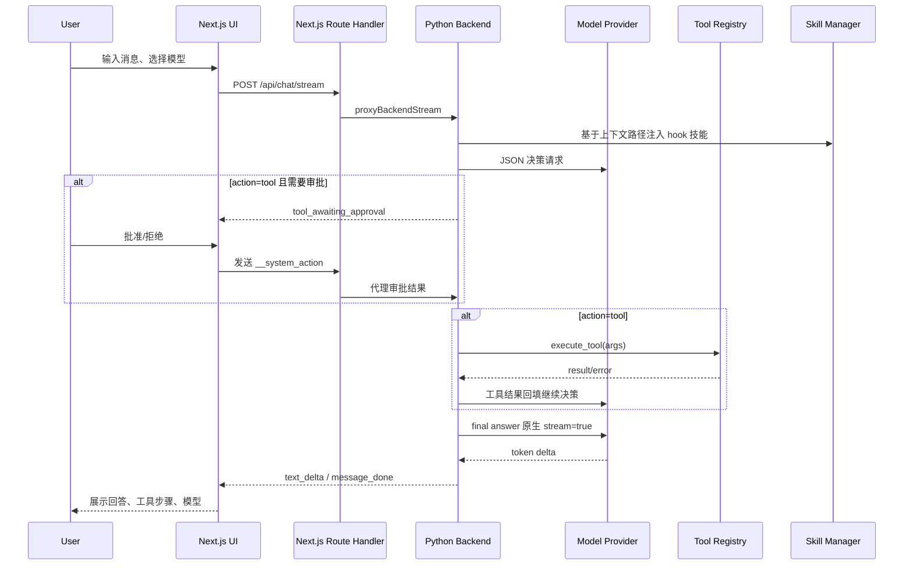

# 手搓 Agent 技术设计文档

## 1. 背景与目标

本项目当前是一个轻量级手写 LLM Agent。它已经具备多模型调用、JSON 决策协议、工具 registry、流式最终回答、会话与上下文压缩、工具审批、技能系统、Next.js 前端和 Docker/Caddy 部署。

技术目标：

- 保持后端透明：继续用 Python 标准库表达 Agent 主链路。
- 保持前端成熟：Next.js + React + TypeScript 作为主交互入口。
- 保持协议清晰：前后端通过 JSON/SSE 事件通信。
- 保持安全边界：工具默认锁定工作区，高风险操作走审批和后端拦截。
- 保持可迭代：模型、工具、技能、会话、部署都能继续独立演进。

非目标：

- 暂不引入完整 Agent 框架、任务队列、多租户账号体系。
- 暂不把本地 Agent 放开到宿主机全盘读写。
- 暂不依赖某个 provider 的专有工具调用协议。

## 2. 当前代码结构

| 路径 | 说明 |
| --- | --- |
| `server.py` | Python HTTP/SSE 后端，负责模型配置、LLM 调用、Agent 主循环、上下文估算、摘要和旧版静态前端服务。 |
| `tools/registry.py` | 工具定义、参数 schema、权限等级、执行器、安全策略和 `skill_manager` 实例。 |
| `skills/manager.py` | 技能扫描、轻量 YAML 解析、hook 匹配、invocable 查询、嵌入式安全命令渲染。 |
| `skills/` | 项目内置/用户创建的技能目录。 |
| `frontend/` | Next.js + React + TypeScript 主前端。 |
| `frontend/src/components/agent-chat.tsx` | 聊天、会话、上下文估算、流式读取、停止生成、视图切换。 |
| `frontend/src/components/tool-steps.tsx` | 工具步骤展示、审批、拒绝、会话级信任。 |
| `frontend/src/components/skill-manager-view.tsx` | 技能与工具管理页。 |
| `frontend/src/app/api/*` | Next.js Route Handler，代理请求到 Python 后端。 |
| `public/` | 旧版原生前端，保留作参考。 |
| `tests/` | Python `unittest` 与手动验证脚本。 |

## 3. 请求链路



## 4. HTTP/API 层

### 4.1 Python 后端接口

| 接口 | 方法 | 说明 |
| --- | --- | --- |
| `/api/models` | `GET` | 模型列表、默认模型、可用性、上下文窗口、预留输出 token。 |
| `/api/tools` | `GET` | 当前工具 schema。 |
| `/api/skills` | `GET` | 已加载技能列表。 |
| `/api/skills` | `POST` | 保存技能。 |
| `/api/skills/:name` | `DELETE` | 删除技能。 |
| `/api/chat` | `POST` | 非流式兼容聊天。 |
| `/api/chat/stream` | `POST` | SSE 聊天主接口。 |
| `/api/summarize` | `POST` | 生成滚动摘要。 |
| `/api/context/estimate` | `POST` | 估算上下文 token 占用。 |

`HOST` 和 `PORT` 控制后端监听地址，默认 `127.0.0.1:8000`。

### 4.2 Next.js API Proxy

`frontend/src/app/api/_backend.ts` 默认代理到 `http://127.0.0.1:8000`，可用 `AGENT_BACKEND_URL` 覆盖。普通接口使用 `proxyBackend`，流式接口使用 `proxyBackendStream`。当后端不可用时，代理会返回稳定 JSON/SSE 错误，避免前端出现空响应 JSON 解析异常。

### 4.3 SSE 事件

当前 `/api/chat/stream` 事件：

| 事件 | 说明 |
| --- | --- |
| `message_start` | assistant 消息开始，包含 message id、实际模型、trace id。 |
| `tool_start` | 工具开始执行。 |
| `tool_result` | 工具成功。 |
| `tool_error` | 工具失败或用户拒绝。 |
| `tool_awaiting_approval` | 工具等待用户确认。 |
| `text_delta` | 最终回答 token 增量。 |
| `message_done` | 消息完成，包含完整 answer、steps、model、trace_id。 |
| `error` | 请求或 Agent 异常。 |

## 5. Agent Runner

`run_agent(user_messages, model_id=None, event_sink=None, trusted_tools=None)` 是当前主循环：

1. 获取模型配置。
2. 提取上下文路径。
3. 构建 system prompt，包含工具 schema、invocable 技能清单和匹配的 hook 技能指令。
4. 调用 LLM 得到 JSON 决策。
5. 如果是工具调用，判断权限和会话信任。
6. 需要确认时返回 `tool_awaiting_approval` 并暂停本次请求。
7. 工具执行后把结果回填给 LLM 继续决策。
8. 得到 final 后，用 `FINAL_ANSWER_SYSTEM_PROMPT` 重新生成面向用户的自然语言回答，并走 provider 原生 stream。
9. 最多循环 10 轮；超过后强制要求模型直接回答。

审批恢复通过一条特殊用户消息完成：

```json
{"__system_action":"approve_tool","trust_session":true,"tool":"shell_exec"}
```

或：

```json
{"__system_action":"reject_tool","reason":"不想执行"}
```

前端会把批准过的工具加入当前会话 `trustedTools`，后续同会话可跳过确认。

## 6. 模型配置

模型配置集中在 `server.py` 的 `MODEL_OPTIONS`：

| 字段 | 说明 |
| --- | --- |
| `id` | 前端和 API 使用的稳定模型 ID。 |
| `label` | 前端展示名。 |
| `provider` | provider 标识。 |
| `model` | 传给 `/chat/completions` 的真实模型名。 |
| `base_url` | provider endpoint，可被环境变量覆盖。 |
| `api_key_envs` | 可用 API Key 环境变量列表。 |
| `thinking` | `enabled` 或 `disabled`。 |
| `reasoning_effort` | 可选推理强度。 |
| `context_window_tokens` | 用于上下文比例估算。 |
| `max_output_tokens` | provider 上限；实际请求使用 `LLM_MAX_TOKENS`。 |

当前 provider：

- 智谱：`ZAI_API_KEY` 或 `ZHIPU_API_KEY`，默认 base URL `https://open.bigmodel.cn/api/paas/v4`。
- DeepSeek：`DEEPSEEK_API_KEY`，默认 base URL `https://api.deepseek.com`。
- 万擎：`WQ_API_KEY`，默认内网 base URL `http://wanqing.internal/api/gateway/v1/endpoints`。
- 小米 MiMo：`MIMO_API_KEY`，默认 base URL `https://token-plan-sgp.xiaomimimo.com/v1`。

## 7. 工具系统

工具定义由 `Tool` 类承载：

```python
Tool(
    name="calculator",
    description="安全计算数学表达式",
    permission=ToolPermission.SAFE_COMPUTE,
    parameters={...},
    handler=_handle_calculator,
)
```

### 7.1 权限等级

| 权限 | 默认行为 |
| --- | --- |
| `safe_read` | 自动执行。 |
| `safe_compute` | 自动执行。 |
| `read_user_file` | 自动执行，但路径限制在工作区。 |
| `repo_read` | 自动执行，搜索范围限制在工作区。 |
| `network_read` | 自动执行，`web_fetch` 禁止本地/内网目标。 |
| `write_file` | 需要确认。 |
| `edit_file` | 需要确认。 |
| `shell` | 默认需要确认，但观察类命令可自动执行。 |

### 7.2 工作区边界

`WORKSPACE_ROOT = ROOT`，即项目根目录。`file_read`、`file_write`、`file_edit` 都要求相对路径，并拒绝绝对路径和跳出工作区的路径。`shell_exec` 的 `cwd` 也固定为项目根目录。

### 7.3 shell 安全

`ToolPermission.is_safe_shell_command` 将观察类命令降级为无需确认。`_handle_shell_exec` 还有后端 denylist，拦截系统破坏、提权、危险重定向、管道到 shell 等模式。输出按 stdout/stderr 分别限制到 100KB。

## 8. 技能系统

技能目录结构：

```text
skills/<name>/
  skill.yaml
  instructions.md
```

当前 `Skill` 字段：

```python
name: str
description: str
type: "hook" | "invocable"
path_patterns: list[str]
trigger_words: list[str]
instructions: str
skill_dir: str
```

### 8.1 Hook 技能

`extract_context_paths` 从用户消息和文件工具步骤中提取类似 `path/to/file.py` 的路径。`SkillManager.get_active_hooks` 使用 `fnmatch` 匹配 `paths`。命中后，`get_skill_instructions_blob` 将技能指令追加到 system prompt。

### 8.2 Invocable 技能

`get_invocable_skills_summary` 会把 invocable 技能清单写进 system prompt。模型可调用：

```json
{"action":"tool","tool":"invoke_skill","args":{"skill_name":"git-committer"}}
```

返回的技能指令会作为工具结果进入后续推理。

### 8.3 当前限制

- YAML 解析是 `_parse_yaml_lite`，不依赖 PyYAML；只可靠支持扁平键值和顶层列表。
- `trigger_words` 当前进入元数据和 UI，但 hook 自动激活主要基于路径。
- 嵌入式命令 `` !`cmd` `` 只允许安全观察类命令，失败或被拦截时会把错误文本注入。

## 9. 上下文与摘要

前端构建发送上下文：

1. 过滤空消息、错误/停止的 assistant 消息。
2. 如果有 `session.summary`，先插入一条用户消息：`以下是此前会话摘要，用于延续上下文：...`
3. 拼接尚未被摘要覆盖的最近消息。

后端 `estimate_context_usage` 会基于实际 Agent system prompt 和消息估算 input tokens：

```json
{
  "input_tokens": 1234,
  "context_window_tokens": 200000,
  "reserved_output_tokens": 2048,
  "available_input_tokens": 197952,
  "ratio": 0.0062
}
```

前端支持 60% / 75% / 90% 自动压缩阈值。触发压缩时保留最近 8 条可用消息，把更早消息发送到 `/api/summarize` 生成滚动摘要。摘要和压缩进度存入 `localStorage`。

## 10. 前端状态

核心本地存储：

```text
agent:sessions
agent:active-session-id
agent:model
```

`ChatSession` 当前包含：

- `id/title/createdAt/updatedAt`
- `modelId`
- `messages`
- `summary/summaryUpdatedAt/summarizedMessageCount/summaryTriggerRatio`
- `trustedTools`

前端没有全局状态库。当前状态仍在 `AgentChat` 内部维护；当设置页、技能页、trace 页继续增长时，再评估 Zustand 或服务端存储。

## 11. 部署设计

生产部署由 Docker Compose 管理三个服务：

```text
Internet -> Caddy :443 -> Next.js frontend :3000 -> Python backend :8000
```

- `backend` 读取 `.env.production`，监听 `0.0.0.0:8000`。
- `frontend` 设置 `AGENT_BACKEND_URL=http://backend:8000`。
- `caddy` 读取 `APP_DOMAIN`，自动申请和续期 HTTPS 证书。

公网 VPS 通常无法访问 `wanqing.internal`，因此万擎模型只有在网络可达时才适合启用。

## 12. 安全设计

- API Key 只从环境变量读取，不进入前端 bundle 和 `localStorage`。
- `/api/models` 不暴露具体 key，只返回 `available`。
- Markdown 使用 `rehype-sanitize`。
- 工具结果以文本/JSON 渲染，不直接注入 HTML。
- 文件读写和 shell 都锁定项目工作区。
- 当前部署没有认证，不适合公开给大量陌生用户；正式扩散前应增加 Caddy basic auth、demo password 或登录系统。

## 13. 测试策略

当前使用 Python 标准库 `unittest`：

```bash
python3 -m unittest discover -s tests
```

已覆盖：

- calculator 安全计算。
- Agent JSON 解析。
- 模型配置和可用性。
- 工具执行 step 结构。
- 文件读取、仓库搜索、网页读取。
- 上下文估算和摘要构建。
- Agent final、tool->final、stream event。
- SkillManager 加载、路径匹配、指令 blob。

前端验证：

```bash
cd frontend
npm run lint
npm run build
```

`tests/verify_skill_injection.py` 和 `tests/verify_skill_tool.py` 是手动验证脚本，不属于 `unittest discover` 的常规单测。

## 14. 后续技术决策

- 后端框架：继续 Python 标准库；路由、SSE、上传、鉴权复杂后再评估 FastAPI。
- Agent 框架：继续自研 Runner；需要可恢复 DAG、多 Agent 协作时再评估 LangGraph。
- 数据库：当前会话在浏览器；需要跨设备/trace/配置持久化时优先 SQLite。
- 状态管理：当前 React 本地状态；跨页面状态复杂后再评估 Zustand。
- 测试：短期继续 `unittest` + lint/build；前端关键路径稳定后引入 Playwright。
