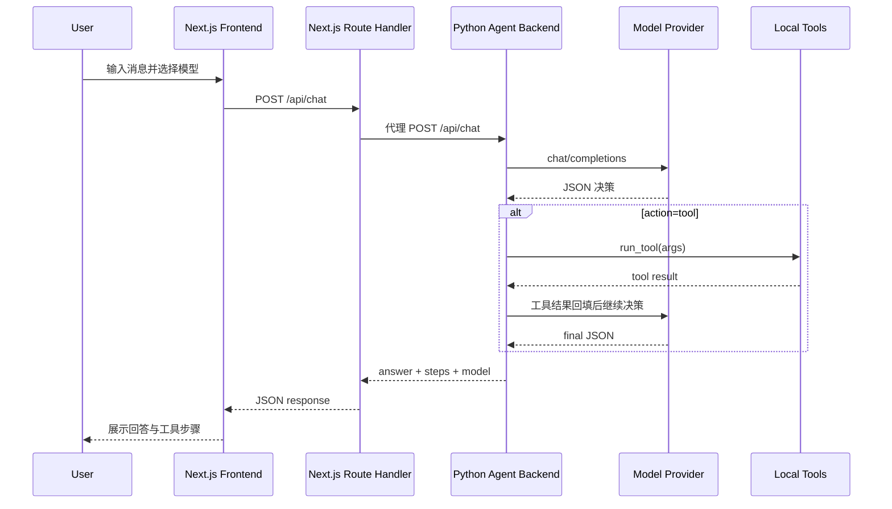
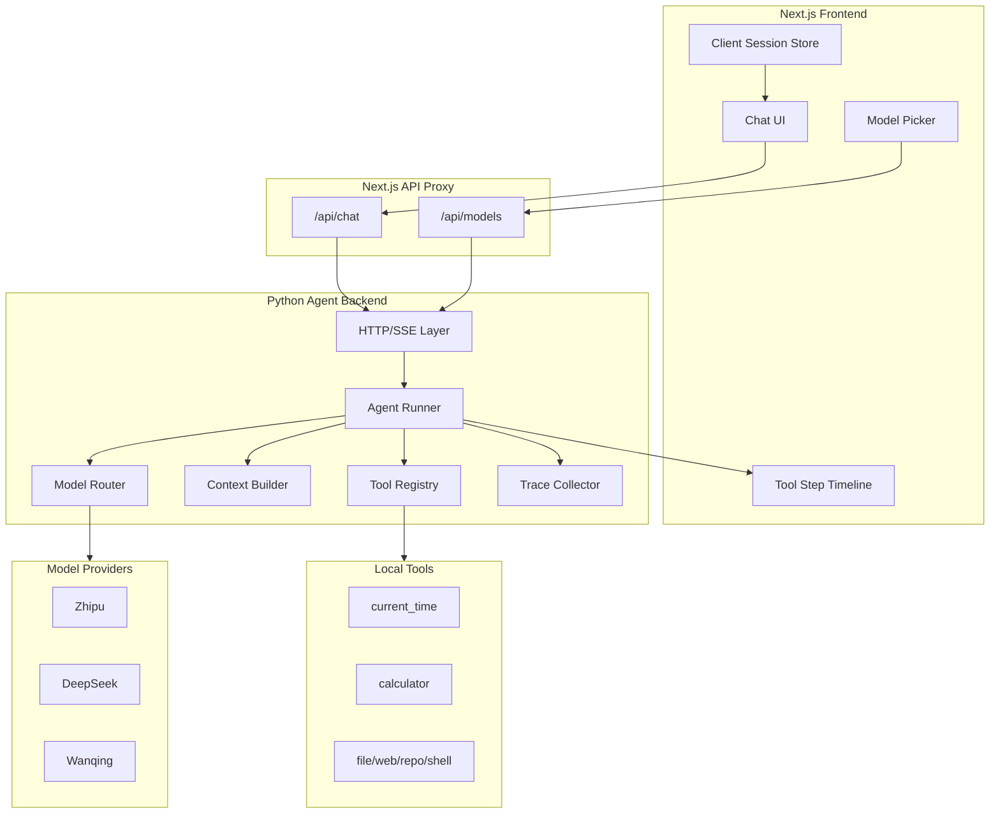

# 手搓 Agent 技术设计文档

## 1. 背景与目标

本项目当前是一个轻量级手写 LLM Agent 原型，已经具备多模型调用、JSON 决策协议、基础工具调用循环、Next.js 聊天界面和工具步骤展示。根据产品规划，下一阶段目标不是直接建设完整 Agent 平台，而是把当前 demo 打磨成一个稳定、可扩展、可学习的个人 Agent 基座。

技术设计目标：

- 保持代码简单可读，优先使用现有 Python 标准库后端和 Next.js 前端。
- 稳定现有对话、模型选择、工具调用主链路。
- 优先落地 P0 能力：流式输出、停止生成、实际使用模型展示、工具步骤 UI 增强、后端核心单测。
- 为 P1/P2 能力预留扩展点：Auto 模型、模型能力标签、会话历史、工具 registry、文件读取、网页读取、本地仓库搜索、计划模式。
- 在工具权限、上下文管理、错误处理和可观测性上建立最小但清晰的边界。

非目标：

- 短期不引入复杂后端框架、数据库、队列或多 Agent 调度平台。
- 短期不实现完整账号体系、云端多租户和企业级权限系统。
- 短期不强依赖某一家模型厂商的专有工具调用协议，继续以 OpenAI-compatible chat completions 为主。

## 2. 当前系统概览

### 2.1 代码结构

| 路径 | 说明 |
| --- | --- |
| `server.py` | Python 标准库 HTTP 后端，负责模型配置、LLM 调用、Agent 循环、工具执行和旧版静态前端服务。 |
| `public/` | 旧版原生 HTML/CSS/JS 前端，可作为轻量参考实现。 |
| `frontend/` | Next.js + React + TypeScript 前端。 |
| `frontend/src/app/api/*` | Next.js Route Handler，代理请求到 Python 后端。 |
| `frontend/src/components/agent-chat.tsx` | 主聊天界面、发送消息、请求状态、消息列表。 |
| `frontend/src/components/model-picker.tsx` | 模型选择器。 |
| `frontend/src/components/tool-steps.tsx` | 工具调用步骤展示。 |
| `frontend/src/lib/types.ts` | 前端核心类型定义。 |
| `docs/product/product-plan.md` | 产品规划与路线图。 |

### 2.2 当前请求链路



### 2.3 当前能力边界

后端已实现：

- 多 provider 模型配置。
- API Key 可用性检测。
- OpenAI-compatible `/chat/completions` 调用。
- 最多 4 轮工具循环。
- `current_time` 和 `calculator` 两个工具。
- Agent JSON 输出协议和容错解析。
- 429/5xx 有限重试。

前端已实现：

- Next.js 聊天 UI。
- 模型选择和 `localStorage` 持久化。
- Markdown 安全渲染。
- 工具步骤折叠展示。
- 请求中状态、错误消息和 60 秒超时。

当前主要技术缺口：

- `/api/chat` 只返回完整 JSON，不支持流式响应。
- 前端虽然收到 `model` 字段，但未在消息维度展示。
- 工具步骤缺少参数、状态、耗时和错误的结构化展示。
- 工具定义硬编码在 `run_tool`，后续扩展成本会上升。
- Agent 核心逻辑缺少自动化测试保护。
- 会话仅保存在浏览器内存，刷新丢失。

## 3. 目标架构

### 3.1 总体分层



### 3.2 设计原则

- 单体优先：当前阶段保留单进程 Python 后端，避免过早拆服务。
- 协议先行：前后端通过稳定的 JSON/SSE 事件协议交互，内部实现可逐步替换。
- 工具可注册：新增工具时只声明 schema、权限等级和执行函数，不修改 Agent 主循环。
- 可观测：每次模型调用和工具调用都形成 step/trace，便于调试和 UI 展示。
- 安全默认：只读工具默认可直接执行，高风险工具必须预留确认机制。
- 渐进增强：先完成 P0 闭环，再扩展 P1/P2 能力。

## 4. 核心模块设计

### 4.1 HTTP/API 层

现状接口：

- `GET /api/models`
- `POST /api/chat`

建议保留现有接口，并新增流式模式：

| 接口 | 方法 | 用途 |
| --- | --- | --- |
| `/api/models` | `GET` | 返回模型列表、默认模型、可用性、能力标签。 |
| `/api/chat` | `POST` | 非流式兼容接口，返回完整回答。 |
| `/api/chat/stream` | `POST` | SSE 流式接口，返回模型输出、工具步骤和完成事件。 |

`POST /api/chat` 请求：

```json
{
  "model": "deepseek-v4-pro",
  "messages": [
    { "role": "user", "content": "现在几点？" }
  ],
  "stream": false,
  "session_id": "optional-session-id"
}
```

`POST /api/chat` 响应：

```json
{
  "answer": "现在是 2026-05-01 14:30:00。",
  "steps": [
    {
      "id": "step-1",
      "type": "tool",
      "status": "success",
      "tool": "current_time",
      "args": { "timezone": "Asia/Shanghai" },
      "result": {
        "timezone": "Asia/Shanghai",
        "timestamp": 1777617000,
        "local_time": "2026-05-01 14:30:00 CST"
      },
      "started_at": 1777616999000,
      "ended_at": 1777617000000,
      "duration_ms": 100
    }
  ],
  "model": "deepseek-v4-pro",
  "trace_id": "trace_xxx"
}
```

SSE 事件建议：

| 事件 | 说明 |
| --- | --- |
| `message_start` | assistant 消息开始，包含 message id、实际模型、trace id。 |
| `text_delta` | 最终回答文本增量。 |
| `tool_start` | 工具调用开始，包含工具名和参数。 |
| `tool_result` | 工具调用成功。 |
| `tool_error` | 工具调用失败。 |
| `message_done` | assistant 消息结束，包含完整 answer 和 steps。 |
| `error` | 请求失败或 Agent 异常。 |

SSE 示例：

```text
event: message_start
data: {"id":"assistant-1","model":"deepseek-v4-pro","trace_id":"trace_1"}

event: tool_start
data: {"step_id":"step-1","tool":"calculator","args":{"expression":"128 * 37"}}

event: tool_result
data: {"step_id":"step-1","result":{"expression":"128 * 37","result":4736},"duration_ms":12}

event: text_delta
data: {"delta":"128 × 37 = "}

event: text_delta
data: {"delta":"4736。"}

event: message_done
data: {"answer":"128 × 37 = 4736。","steps":[...]}
```

### 4.2 Agent Runner

Agent Runner 负责一次用户请求的完整生命周期：

1. 读取模型配置。
2. 构建 system prompt 和最近上下文。
3. 调用 LLM 获取 JSON 决策。
4. 解析决策。
5. 如需工具，执行工具并记录 step。
6. 将工具结果回填给模型继续决策。
7. 返回最终回答、工具步骤和实际模型。

建议将当前 `run_agent` 拆分为以下函数：

| 函数 | 职责 |
| --- | --- |
| `build_agent_messages(user_messages, tool_specs)` | 构建 system prompt 和上下文。 |
| `parse_agent_decision(raw)` | 解析模型 JSON 决策。 |
| `execute_tool_step(decision, registry)` | 执行工具并生成结构化 step。 |
| `run_agent(request, event_sink=None)` | Agent 主循环，支持非流式和流式事件输出。 |

主循环约束：

- 默认最大工具轮次保持 4。
- 每次工具调用必须记录 step。
- 工具异常不直接中断 Agent，除非属于系统级错误。
- 达到最大工具轮次后，强制要求模型输出 final。
- 所有返回给前端的错误需要可读，不暴露 API Key、完整 provider token 或内部敏感路径。

### 4.3 模型配置与路由

当前 `MODEL_OPTIONS` 可以继续作为单文件配置源，但需要扩展公共字段：

```python
{
    "id": "deepseek-v4-pro-thinking",
    "label": "DeepSeek V4 Pro Thinking",
    "provider": "deepseek",
    "model": "deepseek-v4-pro",
    "base_url": "...",
    "api_key_envs": ["DEEPSEEK_API_KEY"],
    "thinking": "enabled",
    "reasoning_effort": "high",
    "capabilities": {
        "speed": "medium",
        "cost": "high",
        "context": "long",
        "reasoning": "strong",
        "tools": true
    },
    "description": "开启思考模式，适合更难的问题；会更慢、更贵。"
}
```

`GET /api/models` 建议返回：

```json
{
  "models": [
    {
      "id": "deepseek-v4-pro-thinking",
      "label": "DeepSeek V4 Pro Thinking",
      "provider": "deepseek",
      "model": "deepseek-v4-pro",
      "thinking": "enabled",
      "description": "开启思考模式，适合更难的问题；会更慢、更贵。",
      "available": true,
      "default": false,
      "capabilities": {
        "speed": "medium",
        "cost": "high",
        "context": "long",
        "reasoning": "strong",
        "tools": true
      }
    }
  ],
  "default": "zhipu-glm-4.7-flash",
  "auto": {
    "id": "auto",
    "label": "Auto",
    "available": true
  }
}
```

Auto 模型路由 MVP 规则：

| 场景 | 推荐模型 |
| --- | --- |
| 短问答、问候、简单改写 | 快速/低成本模型，如 `zhipu-glm-4.7-flash` 或 `deepseek-v4-flash` |
| 明确包含“分析、规划、架构、复杂、比较”等关键词 | Pro 或 Thinking 模型 |
| 数学计算、时间查询等工具类任务 | 支持工具链路且稳定的默认模型 |
| 用户显式选择具体模型 | 不走 Auto，尊重用户选择 |

短期可以用启发式路由，后续再引入模型选择器 LLM 或策略配置。

### 4.4 工具 Registry

当前工具硬编码在 `run_tool`，建议抽象为 registry：

```python
TOOLS = {
    "current_time": {
        "name": "current_time",
        "description": "获取当前本地时间",
        "permission": "safe_read",
        "parameters": {
            "type": "object",
            "properties": {
                "timezone": {"type": "string", "default": "Asia/Shanghai"}
            }
        },
        "handler": current_time_tool,
    },
    "calculator": {
        "name": "calculator",
        "description": "安全计算数学表达式",
        "permission": "safe_compute",
        "parameters": {
            "type": "object",
            "required": ["expression"],
            "properties": {
                "expression": {"type": "string"}
            }
        },
        "handler": calculator_tool,
    },
}
```

工具权限等级：

| 等级 | 说明 | 是否需要确认 |
| --- | --- | --- |
| `safe_read` | 读取时间、读取公开配置、查询只读信息 | 否 |
| `safe_compute` | 本地纯计算，不访问外部资源 | 否 |
| `read_user_file` | 读取用户文件或项目文件 | 可配置，默认对目录做限制 |
| `network_read` | 搜索或读取网页 | 可配置，默认允许只读 |
| `repo_read` | 本地仓库搜索、读取代码 | 否，但限制工作区 |
| `write_file` | 创建或修改文件 | 是 |
| `shell` | 执行命令 | 是，且需要 allowlist/denylist |

工具 step 统一结构：

```json
{
  "id": "step-1",
  "type": "tool",
  "status": "success",
  "tool": "calculator",
  "args": { "expression": "128 * 37" },
  "result": { "expression": "128 * 37", "result": 4736 },
  "error": null,
  "started_at": 1777616999000,
  "ended_at": 1777616999012,
  "duration_ms": 12
}
```

### 4.5 上下文管理

当前后端只取最近 12 条消息。短期保留该策略，并明确边界：

- 只将 `role` 和 `content` 发送给模型，不把前端 UI-only 字段送入上下文。
- 工具调用结果只在 Agent 内部追加给模型，不作为用户可编辑消息直接混入历史。
- 长对话摘要在 P2 实现，作为 `system` 或 `user` 上下文片段插入。

建议内部消息结构：

```python
{
    "role": "user" | "assistant" | "system",
    "content": "...",
    "metadata": {
        "message_id": "...",
        "model": "...",
        "steps": []
    }
}
```

前端消息结构建议：

```ts
export type DisplayMessage = {
  id: string;
  role: "user" | "assistant";
  content: string;
  model?: string;
  steps?: ToolStep[];
  status?: "streaming" | "done" | "error" | "stopped";
};
```

### 4.6 前端交互设计

P0 前端改造：

- `AgentChat` 支持 `AbortController` 停止生成。
- assistant 消息在请求开始时立即插入，流式增量更新 `content`。
- 每条 assistant 消息展示实际使用模型。
- `ToolSteps` 展示工具状态、参数、结果、错误、耗时。
- 非流式接口保留作为 fallback。

消息状态：

| 状态 | UI 表现 |
| --- | --- |
| `streaming` | 展示光标/加载状态，允许停止。 |
| `done` | 展示完整回答、模型、工具步骤。 |
| `error` | 展示错误文案，可重试。 |
| `stopped` | 保留已生成内容，标记已停止。 |

工具步骤 UI：

- 折叠状态显示“2 个工具调用”。
- 展开后每个 step 显示工具名、成功/失败状态、耗时。
- 参数和结果用格式化 JSON 展示。
- 错误 step 使用明确颜色和错误信息。

模型选择器 P1 改造：

- 增加 `Auto` 选项。
- 按 provider 分组。
- 展示 `快`、`低成本`、`强推理`、`长上下文`、`支持工具` 等标签。
- 未配置 Key 的模型保持 disabled，并提示需要设置的环境变量或配置入口。

### 4.7 会话历史

P1 MVP 可先用浏览器本地存储，不引入数据库：

```ts
export type Session = {
  id: string;
  title: string;
  createdAt: number;
  updatedAt: number;
  modelId: string;
  messages: DisplayMessage[];
};
```

本地存储 key：

- `agent:sessions`
- `agent:active-session-id`
- `agent:model`

约束：

- 单个会话只保存必要字段，避免把大段 trace 全量塞入 localStorage。
- 后续如果引入后端存储，可保持同样的 Session schema。
- 会话标题可先使用第一条用户消息截断生成。

## 5. 流式输出与停止生成设计

### 5.1 流式策略

由于当前 Agent 协议要求模型先输出 JSON 决策，流式存在两种模式：

1. 工具决策阶段不向用户流式展示原始 JSON，只发送 `tool_start/tool_result` 事件。
2. 最终回答阶段可切换到直接自然语言流式，或者继续要求模型输出 final JSON 后再按 answer 字段分片发送。

MVP 推荐采用第 2 种保守方案：

- 第一阶段仍然让模型输出 JSON，保证工具调用链路稳定。
- 后端拿到 final answer 后，以 SSE `text_delta` 分片发送给前端。
- 用户体感上仍是流式出现，改造风险低。

后续增强：

- 引入更自然的双通道协议：模型内部决策用 JSON，最终回答允许普通文本流式。
- 如果 provider 原生支持 stream，则后端可边接收边解析最终回答。

### 5.2 停止生成

前端：

- 请求开始时创建 `AbortController`。
- 发送按钮切换为停止按钮。
- 点击停止后 `controller.abort()`。
- 当前 assistant 消息状态置为 `stopped`，保留已生成内容。

后端：

- Python 标准库服务无法优雅感知所有客户端断开场景，但可以做到：
  - SSE 写入失败时停止继续发送。
  - 每轮工具/模型调用前检查请求状态。
  - 控制每次 LLM 请求 timeout。

注意：如果 provider 请求已经发出，前端 abort 不一定能取消上游模型计算。短期以“前端停止接收和展示”为 MVP，后续再考虑 provider-level cancellation。

## 6. 安全设计

### 6.1 API Key

- API Key 只读取环境变量，不返回给前端。
- `/api/models` 只返回 `available`，不返回具体环境变量值。
- 错误消息不得包含 Authorization header、完整请求 payload 或 provider 返回的敏感内容。

### 6.2 工具安全

- `calculator` 继续使用 AST 白名单，禁止 `eval`。
- 文件读取工具必须限制在允许目录内，默认工作区内只读。
- 网页读取工具需要超时、最大响应体大小和内容类型限制。
- Shell 工具必须默认关闭，启用时需要确认和命令限制。
- 写文件、发请求、执行命令等高风险工具必须预留 approval 状态。

### 6.3 前端渲染安全

- Markdown 继续使用 `rehype-sanitize`。
- 工具结果作为文本/JSON 展示，不直接注入 HTML。
- 错误信息做纯文本展示。

## 7. 可观测性与错误处理

### 7.1 Trace

每次 `/api/chat` 生成一个 `trace_id`，贯穿：

- 模型选择结果。
- 模型调用次数。
- 工具调用步骤。
- 每步耗时。
- 错误类型。

短期 trace 可只返回给前端和打印到 stdout；后续再持久化。

### 7.2 错误分类

| 错误类型 | 示例 | 前端展示 |
| --- | --- | --- |
| `validation_error` | messages 不是数组 | 请求参数错误 |
| `model_config_error` | 未知模型或缺 API Key | 模型不可用，请检查配置 |
| `llm_http_error` | provider 429/500 | 模型服务暂时不可用 |
| `llm_timeout` | provider 超时 | 请求超时，请重试 |
| `tool_error` | 工具参数错误 | 工具调用失败，并展示 step |
| `agent_protocol_error` | 模型 JSON 无法解析 | Agent 输出格式异常 |

建议后端错误响应：

```json
{
  "error": {
    "code": "model_config_error",
    "message": "请先设置 DEEPSEEK_API_KEY 环境变量",
    "trace_id": "trace_xxx"
  }
}
```

为兼容现有前端，可过渡期同时支持旧格式：

```json
{ "error": "请先设置 DEEPSEEK_API_KEY 环境变量" }
```

## 8. 测试策略

### 8.1 后端单测

建议新增 `tests/`：

| 测试文件 | 覆盖内容 |
| --- | --- |
| `tests/test_calculator.py` | 四则运算、常量、非法表达式、除零、溢出。 |
| `tests/test_agent_json.py` | 标准 JSON、code fence JSON、工具 fallback、普通文本 fallback。 |
| `tests/test_models.py` | 默认模型、未知模型、API Key 可用性。 |
| `tests/test_tools.py` | 工具成功、未知工具、参数错误、错误 step。 |
| `tests/test_agent_runner.py` | mock LLM 下的 final、tool->final、多轮上限。 |

推荐命令：

```bash
python -m pytest
```

若短期不想引入 pytest，也可以先使用 `unittest`，但 pytest 对参数化测试更方便。

### 8.2 前端验证

每次前端改动至少运行：

```bash
cd frontend
npm run lint
npm run build
```

关键手工验收场景：

- 模型列表加载成功，未配置 Key 的模型 disabled。
- 发送普通聊天问题，展示回答。
- 发送计算问题，展示工具调用步骤。
- 发送长文生成，回答逐步出现。
- 点击停止，生成中断且保留已有内容。
- assistant 消息下方展示实际使用模型。

## 9. 分阶段实施计划

### Phase 0：稳定当前主链路

- 为 `safe_calculate`、`parse_agent_json`、`get_model_config`、`run_tool` 增加后端单测。
- 将工具 step 扩展为带 `status/duration/error` 的统一结构。
- 前端 `ToolSteps` 支持结构化展示。
- 前端展示每条 assistant 消息实际使用模型。

验收标准：

- 后端测试可一键运行。
- 当前非流式聊天、时间工具、计算工具行为不回退。
- 用户能看清每次回答由哪个模型生成。
- 工具失败不会导致页面崩溃。

### Phase 1：流式输出与停止生成

- 新增 `/api/chat/stream` SSE 接口。
- Next.js Route Handler 代理 SSE 响应。
- 前端支持读取 `ReadableStream` 或 `EventSource` 等价能力。
- 请求中按钮切换为停止。
- 保留 `/api/chat` 作为 fallback。

验收标准：

- 长回答可以逐步显示。
- 点击停止后不再追加内容。
- 工具步骤能在流式过程中出现或在完成时展示。
- 超时和错误能正确落到 assistant 错误消息。

### Phase 2：模型体验产品化

- `/api/models` 增加 capabilities 字段。
- 模型选择器按 provider 分组。
- 增加 `Auto` 模式和启发式模型路由。
- 前端展示速度、成本、推理、上下文、工具支持标签。

验收标准：

- 用户可以选择 Auto。
- Auto 简单任务走快模型，复杂任务走 Pro/Thinking。
- 模型列表在 10 个以上模型时仍清晰可扫。

### Phase 3：工具系统扩展

- 引入工具 registry。
- 将 `current_time`、`calculator` 迁移到 registry。
- 新增只读工具：文件读取、本地仓库搜索、网页读取。
- 为高风险工具预留 approval 协议。

验收标准：

- 新增工具不需要改 Agent 主循环。
- 工具 schema 能进入 system prompt。
- 工具权限等级能在 step 中体现。

### Phase 4：会话与上下文

- 前端本地会话列表。
- 会话新建、重命名、删除、恢复。
- 长对话摘要策略。
- 每个会话保存模型选择和消息历史。

验收标准：

- 刷新页面后能恢复历史会话。
- 长对话不会无限增长发送上下文。

## 10. 关键技术决策

### 10.1 短期继续保留 Python 标准库后端

原因：

- 当前项目定位是“可学习、可演示、可扩展”的个人 Agent 基座。
- 单文件后端便于理解 Agent 核心循环。
- P0/P1 能力不需要复杂框架才能完成。

触发迁移条件：

- 路由、SSE、文件上传、鉴权和中间件复杂度明显上升。
- 需要更成熟的异步取消、并发控制和后台任务。

候选迁移路径：

- FastAPI + Uvicorn，用于更好的 SSE、请求模型校验、OpenAPI 文档和测试。

### 10.2 Agent 协议先保持 JSON 决策

原因：

- 兼容所有 OpenAI-compatible 模型。
- 便于教学和调试。
- 与当前工具循环代码匹配。

风险：

- 模型可能输出不严格 JSON。
- 最终回答的自然流式体验受限。

缓解：

- 保留容错解析。
- 增加协议失败测试。
- 后续引入“工具决策 JSON + final 文本流”的混合协议。

### 10.3 会话先放本地浏览器

原因：

- 当前没有用户体系和服务端存储。
- P1 目标是解决刷新丢失，而不是跨设备同步。
- 本地存储改造成本低。

风险：

- localStorage 容量有限。
- 数据只在单设备可用。

缓解：

- 限制会话数量和消息长度。
- 后续抽象 SessionRepository，再替换为服务端存储。

## 11. 数据类型建议

前端类型：

```ts
export type ToolStepStatus = "running" | "success" | "error" | "skipped";

export type ToolStep = {
  id: string;
  type: "tool" | "tool_error";
  status: ToolStepStatus;
  tool: string;
  args: Record<string, unknown>;
  result?: unknown;
  error?: string | null;
  startedAt?: number;
  endedAt?: number;
  durationMs?: number;
};

export type DisplayMessage = {
  id: string;
  role: "user" | "assistant";
  content: string;
  model?: string;
  steps?: ToolStep[];
  status?: "streaming" | "done" | "error" | "stopped";
};

export type AgentResponse = {
  answer: string;
  steps: ToolStep[];
  model: string;
  traceId?: string;
};
```

后端内部类型可先用 dict，等模块拆分后再引入 `dataclasses`：

```python
@dataclass
class ToolStep:
    id: str
    type: str
    status: str
    tool: str
    args: dict
    result: object | None
    error: str | None
    started_at: int
    ended_at: int | None
    duration_ms: int | None
```

## 12. 验收清单

P0 完成后应满足：

- `GET /api/models` 正常返回模型列表、默认模型和可用性。
- `POST /api/chat` 兼容现有前端。
- 普通问答返回最终答案。
- 时间查询触发 `current_time` 工具。
- 数学问题触发 `calculator` 工具。
- 工具 step 展示工具名、参数、结果、状态、耗时。
- assistant 消息展示实际使用模型。
- 后端核心单测覆盖 Agent JSON、calculator、工具执行和模型配置。
- 前端 `npm run lint` 和 `npm run build` 通过。

P1 完成后应满足：

- `/api/chat/stream` 可用。
- 长回答可以流式展示。
- 用户可停止生成。
- Auto 模型可选并能返回实际使用模型。
- 模型选择器按 provider 分组并展示能力标签。

## 13. 后续演进方向

当 MVP 稳定后，可以按以下顺序继续推进：

1. 工具 registry 和只读工具扩展，优先支持文件读取、本地仓库搜索、网页读取。
2. 计划模式，让复杂任务先展示计划再执行。
3. 会话历史和长上下文摘要。
4. 工具调用 approval 协议，用于写文件、shell、外部服务等高风险操作。
5. trace 页面和成本统计。
6. 多 Agent 配置和知识库能力。
